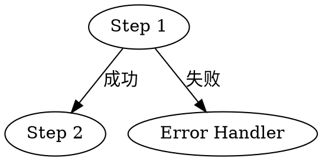

# SKILL 文件编写规范指南

> 参考：[腾讯云开发者社区 — 让AI稳定交付的秘密：SKILL文件的5个最佳实践](https://cloud.tencent.com/developer/article/2646785)
>
> 编写 Claude Skill 时，请遵循本指南中的规范。本指南旨在帮助编写高质量、可复用、稳定的 Skill 文件。

---

## 目录

- [1. 核心认知：SKILL 是什么](#1-核心认知skill-是什么)
- [2. SKILL.md 推荐结构](#2-skillmd-推荐结构)
- [3. 最佳实践一：精准触发描述](#3-最佳实践一精准触发描述)
- [4. 最佳实践二：傻瓜化工作流](#4-最佳实践二傻瓜化工作流)
- [5. 最佳实践三：模块化设计](#5-最佳实践三模块化设计)
- [6. 最佳实践四：表格承载结构化信息](#6-最佳实践四表格承载结构化信息)
- [7. 最佳实践五：持续迭代优化](#7-最佳实践五持续迭代优化)
- [8. 本项目 Skill 检查清单](#8-本项目-skill-检查清单)

---

## 1. 核心认知：SKILL 是什么

**SKILL 是一份给 AI 看的"操作手册"**，以 Markdown 文件形式存在，告诉 AI：

- 当用户提出某类需求时，应该遵循哪些规范
- 调用哪些工具
- 输出什么样的结果

传统做法是每次对话都重新写很长的 Prompt，既费时又不稳定。而 SKILL 文件一次编写、反复复用，AI 每次执行前都会"阅读"它。

> 💡 **SKILL = 可复用的专家级执行规范，是 AI 工作流的基础设施**

## 2. SKILL.md 推荐结构

一份高质量的 SKILL 文件通常包含以下模块（按出现顺序）：

| 模块 | 说明 | 必要性 |
|:-----|:------|:-------|
| **Frontmatter** | 元数据：name、description、version、author 等 | ✅ 必需 |
| **Overview / 概述** | 一句话说明本 Skill 做什么，适用场景 | ✅ 必需 |
| **When to Use** | 什么情况下触发本 Skill | ✅ 必需 |
| **When NOT to Use** | 明确排除不适用场景 | ✅ 推荐 |
| **Workflow / 使用流程** | 分步骤列出执行逻辑 | ✅ 必需 |
| **Quick Reference** | 参数速查、依赖关系 | ✅ 推荐 |
| **Error Handling / 异常处理** | 常见问题及降级策略 | ✅ 推荐 |
| **Security Constraints / 安全约束** | 明确允许和禁止的操作 | ✅ 推荐 |
| **References / 参考文档** | 指向子文件、外部资源 | ⭕ 按需 |

### Frontmatter 规范

```yaml
---
name: skill-name
description: >
  Use when the user mentions X, Y, Z, or asks about A, B, C.
  Not for M, N scenarios.
metadata:
  author: AuthorName
  version: 1.0.0
  updated: YYYY-MM-DD
---
```

**关键：** `description` 是 AI 系统判断是否触发此 Skill 的唯一入口，必须精准。

### 主文件保持精简

**SKILL.md 主文件保持在 200 行以内**，复杂内容拆分到子文件中：

```
my-skill/
├── SKILL.md              ← 主入口，精简
├── references/           ← 参考文档
│   ├── template.md       ← 输出模板
│   └── api-docs.md       ← 接口文档
├── scripts/              ← 执行脚本
│   └── run.py
├── tests/                ← 测试
│   └── test_run.py
└── assets/               ← 资产文件
    └── sample.xlsx
```

## 3. 最佳实践一：精准触发描述

`description` 是 Skill 的"入口"，AI 系统根据这段描述判断当前任务是否需要调用此 Skill。

### 写法规范

**❌ 差的描述：**

```yaml
description: "用于写文章时使用"
```

**✅ 好的描述：**

```yaml
description: >
  Use when the user mentions "article", "blog post", "write a tweet",
  "publish to WeChat", or asks for content creation, copywriting, or
  social media post generation.
  Not for modifying or editing existing documents.
```

### 本项目的具体做法

1. **中英文关键词都要覆盖** — 用户可能用中文或英文表达需求
2. **包含否定排除** — 明确说明"本 Skill 不处理什么"
3. **具体化触发词** — 写用户实际会说的词语，而非抽象概念
4. **使用 `>` 折叠长文本** — 避免字符串过长导致解析问题

### 示例（来自本项目的 dms-weekly-report）

```yaml
description: >
  Use when the user asks for DMS weekly report, inquiry summary, completed inquiry
  extraction, or mentions "自动周报", "周报生成", "询价汇总", "本周询价", "已办询价",
  "做周报", "一键周报", "导出询价明细", "帮我做一下周报".
  Not for modifying or approving DMS data.
```

## 4. 最佳实践二：傻瓜化工作流

不要假设 AI 会"举一反三"。工作流程的每一步都应该像写给新人的 SOP。

### 编号步骤

```
### 步骤 1：确认日期范围
...
### 步骤 2：检查运行环境
...
### 步骤 3：运行脚本
...
### 步骤 4：呈现结果
...
```

> 📊 实验表明：AI 读到"第1步：先做X，再做Y"的结构，比读到一段描述性文字执行效果好 **3 倍以上**。

### 条件分支

关键决策点说明"如果…则…"：

```markdown
根据用户选择：
- **本周（默认）** → 不带 `--start-date` 运行脚本
- **上周** → 用 `--weeks 1` 运行脚本
- **自定义** → 让用户输入起止日期，用 `--start-date X --end-date Y` 运行脚本
```

### 提供可执行的代码块

每个步骤附带可以直接复制执行的命令：

```bash
SKILL_DIR="$HOME/.claude/skills/dms-weekly-report"
python "$SKILL_DIR/scripts/run_weekly_report.py" --output-dir "$PWD"
```

### 使用流程图（可选）

复杂逻辑可用 Graphviz DOT 语言描述流程图，AI 能理解：



## 5. 最佳实践三：模块化设计

### 目录层级

```text
skill-name/
├── SKILL.md              # 主入口，200行以内
├── references/           # MD 参考文档
│   ├── template.md       # 输出模板
│   └── examples.md       # 示例
├── scripts/              # 脚本文件
│   ├── run.py            # 主脚本
│   └── helper.py         # 辅助模块
├── tests/                # 测试（如有）
│   └── test_run.py
└── assets/               # 静态资源（Excel 模板、图片等）
```

### 主文件职责

主文件只告诉 AI：

- **什么时候**去读哪个子文件
- **按什么顺序**执行
- **关键约束**是什么

### 设计原则

- scripts/ 中的脚本应职责单一，方便独立测试和跨 skill 复用
- references/ 中的文档应解决具体问题（"如何输出"、"如何调用 API"）
- assets/ 存放数据文件（Excel 模板、库存文件等），不存放代码
- 多个 skill 共用的脚本考虑抽离为共享模块

## 6. 最佳实践四：表格承载结构化信息

AI 读表格比读段落效率更高，提取信息更准确。

### 适合使用表格的场景

| 信息类型 | 示例 |
|:---------|:-----|
| 参数说明 | 参数名、含义、默认值 |
| 错误码 | 错误码、含义、解决方案 |
| 配置项 | 配置名、可选值、说明 |
| 状态映射 | 状态值、含义、下一步操作 |
| 命令速查 | 命令、说明、示例 |

### 示例（来自本项目）

```markdown
| 参数 | 说明 | 默认值 |
|------|------|--------|
| `--output-dir DIR` | 输出目录 | 当前工作目录 |
| `--headless` | 无头模式（不显示浏览器） | 显示浏览器 |
| `--weeks N` | 最近 N 周（0=本周, 1=上周） | 0 |
```

```markdown
| 错误 | 正确做法 |
|------|---------|
| BOM 确认前填写产品信息 | 严格按顺序执行 |
| 跳过用户确认直接执行下一步 | 每步都必须使用 AskUserQuestion |
| 自动关闭浏览器 | 填写完成后保持浏览器打开 |
```

> **不要写成：** "如果遇到40001错误，说明access_token无效，需要重新获取……"
> 
> **要写成：**
> 
> | 错误码 | 含义 | 解决方案 |
> |--------|------|---------|
> | 40001 | access_token 无效 | 重新获取 access_token |

## 7. 最佳实践五：持续迭代优化

第一版 Skill 很少是完美的。每次执行后复盘，持续迭代。

### 迭代清单

| 现象 | 优化方向 |
|:-----|:---------|
| AI 不触发 Skill | 优化 `description`，增加更多触发关键词 |
| 输出格式不对 | 在 output spec 中增加反例（"不要这样做"） |
| 步骤执行顺序错误 | 在关键步骤前加"必须先完成X才能进行Y" |
| 遗漏边界情况 | 在异常处理章节补充新的场景 |
| 脚本报错 | 将常见错误及解决方案写入 FAQ |

### 反思机制（本项目已采用）

在 Skill 工作流的末尾加入回顾环节：

```markdown
### 步骤 N：回顾与反思

流程完成后，agent 主动自我反思：
1. 本次执行中遇到了哪些问题？
2. 数据是否完整合理？
3. 当前 SKILL.md 的说明是否能覆盖这些场景？
4. 脚本是否有 bug 或功能缺失？

使用 AskUserQuestion 主动向用户提出优化建议，确认后更新 SKILL.md。
```

> 💡 一个经过 **5 次迭代** 的 Skill，执行质量可以超过大多数手写 Prompt。
