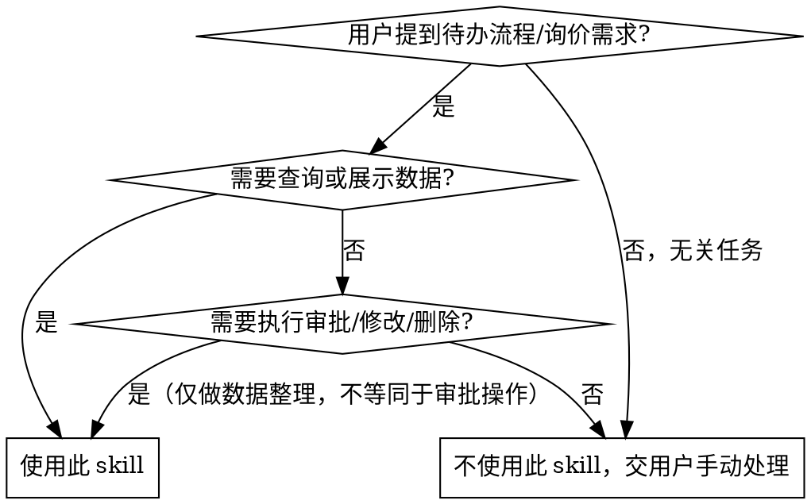

# DMS 非标询价 — 交互式工作流

## 概述

DMS 非标询价工作流：自动提取 DMS 待办流程 → 逐步骤用户确认 → 库存匹配 → 生成 BOM → 填写产品信息。
**核心约束：每一步必须使用 `AskUserQuestion` 确认后才能继续，不允许跳过任何确认环节。**

**关键规则：所有需要用户确认的地方，必须使用 `AskUserQuestion` 工具，不能仅打印到终端等待。每步均需用户确认，不跳过任何确认环节。**

## 前置依赖

```bash
pip install playwright openpyxl pandas calamine
playwright install chromium
```

首次安装即可，无需重复。

> **关于浏览器模式：**
> - **默认：弹出浏览器窗口**（完整 Chromium，可见操作过程，便于观察和调试）
> - **可选 `--headless`：** 无头模式（静默后台运行，不显示窗口），需要额外安装 `chromium_headless_shell`。如 headless 启动失败，脚本会自动回退到弹出窗口模式。
> - 检测 headless shell 是否已安装：
> ```bash
> python ~/.claude/skills/dms-inquiry-bom/scripts/dms_credentials.py --check-browser
> ```
> - 未安装 headless shell 时运行 `playwright install chromium` 即可。

**检测 Chromium 是否已安装（推荐使用 dms_credentials.py 的更全面检测）：**

```bash
python ~/.claude/skills/dms-inquiry-bom/scripts/dms_credentials.py --check-browser
```

此命令会同时检测完整 Chromium 和 headless shell，并给出安装建议。

```bash
python -c "from playwright.sync_api import sync_playwright; p=sync_playwright().start(); print('✅', p.chromium.executable_path); p.stop()"
```

如果报错，说明 Chromium 未安装，运行 `playwright install chromium` 即可。

## 核心模式（三步确认法）

```
用户触发 → [提取] 拉取待办 → [AskUserQuestion] 用户确认需求
  → [库存匹配] 查库存/算配置 → [AskUserQuestion] 用户确认方案
  → [生成BOM] 输出Excel → [AskUserQuestion] 用户确认BOM
  → [填写产品信息] 提交到DMS
  → [回顾反馈] 主动询问改进建议 → 根据反馈更新
```

**原则：** 每一步都向用户展示结果，**使用 `AskUserQuestion` 工具**获得明确确认后才进行下一步。

## 何时使用 vs 不使用



### 使用
- 用户提到 DMS 待办流程需要处理
- 用户说"看下待办"、"有什么需求"
- 需要生成 BOM 清单（Excel）
- 需要从库存列表匹配物料（组件/逆变器/并网箱）
- 需要在 DMS 产品信息页填写数据
- 用户提到"非标询价"关键词

### 不使用
- 用户要求**审批通过/驳回/删除**流程（必须由用户在浏览器中手动操作）
- 用户要求修改已提交的数据
- 用户要求执行下单、发邮件等写操作
- 场景不涉及 DMS 或待办流程
- 安全约束：**本 skill 仅做查询和数据整理，审批操作必须由用户在 DMS 页面手动完成**

## 步骤概览

| 步骤 | 脚本 | 用户确认点 |
|------|------|-----------|
| 1. 检查登录凭据 | `dms_credentials.py` | — |
| 2. 提取待办流程 | `run_inquiry_extract.py` | 展示待办列表，确认需求 |
| 3. 库存匹配 | `inventory_query.py` + `inverter_config.py` | 确认匹配方案 |
| 4. 生成 BOM | `run_inquiry_bom.py` | 确认 BOM 无误 |
| 5. 填写产品信息 | `fill_product_info.py` | —（填写后浏览器保持打开，供用户手动审批）|
| 6. 回顾与反馈 | `AskUserQuestion` | 主动询问是否有问题、是否需要优化 skill |

## 执行步骤

### 步骤 0：检查环境

**检查 DMS 凭据 + Chromium 浏览器是否就绪：**

```bash
SKILL_DIR="$HOME/.claude/skills/dms-inquiry-bom"
python "$SKILL_DIR/scripts/dms_credentials.py" --check-browser
```

> ⚠️ 注意：不要使用 `find` 命令动态查找 SKILL_DIR，skill 文件在临时目录中可能被复制到 `/tmp/tianhe-skills-check/`，应直接使用 `~/.claude/skills/dms-inquiry-bom` 路径。skill 已加载时路径一定存在，无需额外检查。如需确认，用 `test -d` 比 `ls` 快得多（避免 Windows 下读取文件元数据）：`test -d ~/.claude/skills/dms-inquiry-bom/scripts/ && echo OK`

输出示例（Chromium 已安装 / headless shell 未安装）：

```
========================================
  浏览器环境检查
========================================
  [Chromium] ✅ 已安装
  [Headless Shell] ✅ 已安装
  ✅ 浏览器环境就绪
  ✅ 无头模式可用

DMS_USER=xxx@trinapower.com
DMS_PASSWORD=xxx
SOURCE=bashrc
```

```
========================================
  浏览器环境检查
========================================
  [Chromium] ✅ 已安装
  [Headless Shell] ❌ 未安装（使用 --headless 时需要）
  ✅ 浏览器环境就绪
  ⚠️ headless shell 未安装，--headless 模式不可用
     如需无头模式请运行:
     playwright install chromium

DMS_USER=xxx@trinapower.com
DMS_PASSWORD=xxx
SOURCE=bashrc
```

- 如果 Chromium 显示 ❌，**使用 `AskUserQuestion` 询问用户是否要安装**，提供安装命令
- 如果返回 `NOT_FOUND`，**使用 `AskUserQuestion` 向用户展示凭据配置说明**并等待回复

**终端中文乱码修复（Windows Bash）：** 如果 JSON 中文显示为乱码，用此命令读取：

```bash
python -c "import json,sys,io;sys.stdout=io.TextIOWrapper(sys.stdout.buffer,encoding='utf-8');print(json.dumps(json.load(open('inquiry_data.json','r',encoding='utf-8')),ensure_ascii=False,indent=2))"
```

### 步骤 1：提取待办流程

```bash
python "$SKILL_DIR/scripts/run_inquiry_extract.py" --output-file "$PWD/inquiry_data.json"
```

参数：

| 参数 | 说明 | 默认 |
|------|------|------|
| `--headless` | 启用无头模式（不弹出浏览器窗口，静默运行）。**不传此参数时默认弹出浏览器窗口**。⚠️ 需要额外安装 `chromium_headless_shell` | 关闭（默认弹出浏览器窗口） |
| `--workers N` | 并行并发数 | 3 |
| `--output-file PATH` | 输出 JSON 路径 | stdout |

读取 `inquiry_data.json`，**使用 `AskUserQuestion` 向用户展示待办摘要，请用户确认**：

```
待办流程 1: {flow_id}
  项目名称: {project_name}
  代理商: {agent_code} {agent_name}
  省公司: {province}
  业务员: {salesperson}
  备注: {remark}
  BOM清单: {bom_items}
  审批历史:
    {node}: {processor} → {status} ({time}) "{opinion}"
```

**⚠️ BOM清单(bom_items)可能为空数组（表示物料均未指定），备注(remark)字段包含关键需求信息。**

**使用 `AskUserQuestion`** 让用户：
1. 确认信息是否准确
2. 选择优先处理哪个流程（多流程时列出所有，让用户选或指定顺序）
3. 哪些物料需从库存查找
4. 有无特殊要求

**不要仅打印到终端等待。**

### 步骤 2：库存匹配

**⚠️ 关键说明 — 库存文件 Excel 结构：**

库存文件有 4 个 sheet，**数据质量不同**：

| Sheet | 用途 | 数据质量 |
|-------|------|---------|
| `组件/逆变器/并网箱` | 汇总视图，含备注（如"停止排产"） | 库存数量可能为 NaN，物料编码有 merged cell 问题 |

**库存文件位置：** 脚本自动搜索 `assets/` 目录或 skill 根目录，无需手动指定路径。如需指定特定文件，使用 `--file` 参数：

```bash
# 不传 --file 时自动搜索 assets/ 下的库存文件
python "$SKILL_DIR/scripts/inventory_query.py" --type 组件 --power 715

# 手动指定文件路径（当需要特定文件时）
INVENTORY_FILE="$HOME/.claude/skills/dms-inquiry-bom/assets/组件、逆变器、并网箱可用库存统计*.xlsx"
INVENTORY_FILE=$(ls $HOME/.claude/skills/dms-inquiry-bom/assets/组件、逆变器、并网箱可用库存统计*.xlsx 2>/dev/null | head -1)
```

**重要操作规则：**

1. **聚合所有仓库**：同一物料编码可能分布在多个仓库（贵阳仓、武汉仓等），数量必须加总。不能只看单条记录。
2. **读取库存备注**：组件 sheet 中有"停止排产"、"库存不足的需要询问周文娟备货情况"等关键预警，必须在展示时一并呈现给用户。

**查询命令示例：**

```bash
# 查询 715W 组件（使用 --file）
python "$SKILL_DIR/scripts/inventory_query.py" --file "$INVENTORY_FILE" --type 组件 --power 715

# 查询 50kW 逆变器
python "$SKILL_DIR/scripts/inventory_query.py" --file "$INVENTORY_FILE" --type 逆变器 --power 50 --brand 天合

# 查并网箱
python "$SKILL_DIR/scripts/inventory_query.py" --file "$INVENTORY_FILE" --type 并网箱 --power 50

# 按物料编码聚合所有仓库的库存总量（推荐）
python "$SKILL_DIR/scripts/inventory_query.py" --file "$INVENTORY_FILE" --type 逆变器 --brand 天合 --aggregate

# 指定读取详细库存工作表
python "$SKILL_DIR/scripts/inventory_query.py" --file "$INVENTORY_FILE" --sheet "组件" --type 组件 --power 715

# 输出 JSON
python "$SKILL_DIR/scripts/inventory_query.py" --file "$INVENTORY_FILE" --type 逆变器 --brand 天合 --json

# 刷新缓存
python "$SKILL_DIR/scripts/inventory_query.py" --refresh
```

**如需配置逆变器（组件总功率 ÷ 逆变器总功率 ≤ 1.2，建议 1.1~1.2）：**

```bash
python "$SKILL_DIR/scripts/inverter_config.py" \
  --file "$INVENTORY_FILE" \
  --component-power 572 \
  --existing 100 \
  --brand 天合
```

**匹配优先级规则（按顺序）：**
1. **有库存 > 无库存**：无库存的物料会导致流程卡住
2. **非原厂机 > 原厂机**（除非项目强制）：非原厂机现货充足
3. **同品牌优先**：减少安装调试复杂度
4. **同品牌内选价格排序最低的**

**展示匹配方案给用户确认时，必须包含：**
- ✅ 每个物料的**多仓库库存汇总**
- ✅ 库存备注/预警信息（停止排产、需询价等）
- ✅ 逆变器 DC/AC 比值

**使用 `AskUserQuestion` 展示库存匹配结果给用户确认方案。**

### 步骤 3：生成 BOM

```bash
python "$SKILL_DIR/scripts/run_inquiry_bom.py" \
  --name "业务员名" \
  --components 120 \
  --items '6B001440:120,AA002415:4,AB001161:1' \
  --project "织金张先生" \
  --output-dir "$PWD"
```

`--items` 支持两种格式：

| 格式 | 示例 |
|------|------|
| 简洁格式（推荐） | `6B001492:30,AA001653:1` |

**验证物料是否存在：** 生成 BOM 前可用 `--validate` 参数检查物料编号是否在库存文件中存在：

```bash
python "$SKILL_DIR/scripts/run_inquiry_bom.py" \
  --items '6B001492:30,AA001653:1' \
  --validate \
  --inventory-file "$INVENTORY_FILE"
```

输出 JSON 结果，包含 valid（存在）和 invalid（不存在）列表。

**使用 `AskUserQuestion` 展示生成的 BOM 文件给用户确认，确认无误后再进行下一步。**

### 步骤 4：填写产品信息（BOM 确认后）

```bash
python "$SKILL_DIR/scripts/fill_product_info.py" \
  --flow-id 2026060519454266 \
  --component-power 715 \
  --component-count 120

# 同时填写逆变器信息
python "$SKILL_DIR/scripts/fill_product_info.py" \
  --flow-id 2026060519454266 \
  --component-power 715 \
  --component-count 120 \
  --inverter-power 50 \
  --inverter-count 1

# 同时填写逆变器和并网箱
python "$SKILL_DIR/scripts/fill_product_info.py" \
  --flow-id 2026060519454266 \
  --component-power 715 \
  --component-count 120 \
  --inverter-power 50 \
  --inverter-count 1 \
  --box-power 50 \
  --box-count 1
```

**⚠️ 此步骤必须在 BOM 确认后执行，不能提前。**

**填写后：** 浏览器保持打开状态，供用户手动检查并点击审批按钮。**不会自动审批，不会自动关闭浏览器。**

### 步骤 5：回顾与反馈（流程完成后）

当前流程的 BOM 生成和产品信息填写完成后（或流程因缺库存等问题卡住时），**agent 主动自我反思本次执行过程**：

**反思清单：**
1. 本次执行中遇到了哪些问题（脚本报错、数据异常、流程卡住）？
2. 当前 SKILL.md 的说明是否能覆盖这些场景？
3. 脚本是否有 bug 或功能缺失？
4. 用户操作过程中有哪些可以优化的交互点？

**将反思结果提炼为具体优化建议，使用 `AskUserQuestion` 主动向用户提出：**

```markdown
AskUserQuestion:
  "本次流程执行中发现了以下问题，建议优化：
   1. [问题1] → 建议 [优化方案]
   2. [问题2] → 建议 [优化方案]
   您是否有补充？确认后我将更新 SKILL.md。"
```

**根据用户确认/补充后：**
- ✅ 更新 SKILL.md 中的说明、注意事项、常见错误
- ✅ 记录到 memory 供下次会话参考
- ✅ 如涉及脚本 bug，更新脚本待修复清单

> **原则：** 先自行反思提炼，再给用户确认补充，而不是空泛地问"有没有要改进的"。

## 多流程处理策略

当提取到多条待办流程时：

1. **一次性展示全部流程摘要**给用户
2. **让用户选择优先处理哪个**（使用 AskUserQuestion 提供选项）
3. 当前流程处理完毕后（或卡住时），**询问是否继续处理下一个**
4. 已处理的流程标记状态，避免重复

## 凭据配置

DMS 登录凭据通过环境变量读取，**不硬编码密码**。检测逻辑集中在 `scripts/dms_credentials.py`，各业务脚本共用（也可直接 CLI 运行 `dms_credentials.py --check-browser` 检查环境）。

检测顺序：当前环境变量 → shell profile（先直读 `export`，再 bash 兜底）→ PowerShell 用户变量。

如果 `dms_credentials.py` 返回 `NOT_FOUND`，告诉用户：

```
请先配置 DMS 登录环境变量：

Bash / Git Bash:
  export DMS_USER="your_email@trinapower.com"
  export DMS_PASSWORD="your_password"

PowerShell:
  $env:DMS_USER="your_email@trinapower.com"
  $env:DMS_PASSWORD="your_password"

永久配置：将上述命令添加到 ~/.bashrc（Bash）或 $PROFILE（PowerShell）。
配置完成后回复"已配置"，我将继续执行。
```

## 安全约束

**本 skill 仅执行查询和数据填充操作，严格遵守：**

| 允许 | 禁止 |
|------|------|
| 登录 | 审批通过/驳回 |
| 导航页面 | 提交表单 |
| 筛选查询 | 删除记录 |
| 读取页面内容 | 修改数据 |
| 填写产品信息 | 执行下单 |

如页面出现审批、提交、删除等操作按钮，**一律不点击**。如意外跳转到审批/修改页面，立即返回并在终端提示用户。

## 常见错误

| 错误 | 正确做法 |
|------|---------|
| BOM 确认前填写产品信息 | 严格按顺序：提取→确认→库存→确认→BOM→确认→填写 |
| 跳过用户确认直接执行下一步 | 每步都必须使用 `AskUserQuestion` 等待用户明确回复 |
| 仅打印到终端不 AskUserQuestion | 所有确认点必须使用 `AskUserQuestion` 工具，不能仅 print |
| 自动关闭浏览器 | 填写完成后浏览器保持打开，让用户手动检查审批 |
| 忽略库存预警 | 库存不足、停止排产等预警必须展示给用户，让用户决定是否继续 |
| 混品牌方案未提示用户 | 同品牌不满足时，告知用户并列出混合品牌方案供选择 |
| `--headless` 报错 `Executable doesn't exist` | **默认直接使用弹出窗口模式**，不传 `--headless`。仅当用户明确要求无头模式时才传该参数。如果 headless 报错，运行 `playwright install chromium` 安装。 |

## 脚本参考

| 脚本 | 路径 | 用途 |
|------|------|------|
| `dms_credentials.py` | `scripts/dms_credentials.py` | 凭据/Chromium 检测 + CLI 环境检查 |
| `run_inquiry_extract.py` | `scripts/run_inquiry_extract.py` | 提取待办流程详情到 JSON |
| `inventory_query.py` | `scripts/inventory_query.py` | 查询组件/逆变器/并网箱库存 |
| `inverter_config.py` | `scripts/inverter_config.py` | 自动计算逆变器配置方案 |
| `run_inquiry_bom.py` | `scripts/run_inquiry_bom.py` | 生成 BOM 清单 Excel |
| `fill_product_info.py` | `scripts/fill_product_info.py` | 填写 DMS 产品信息（Element UI） |
| `browser_manager.py` | `scripts/browser_manager.py` | 共享浏览器管理器（单例模式） |

## 示例

**输入：** 待办流程，覃建发提交，30 张 730W 组件 + 50kW 并网箱，物料均已指定
**执行：**

```bash
SKILL_DIR="$HOME/.claude/skills/dms-inquiry-bom"
python "$SKILL_DIR/scripts/run_inquiry_bom.py" \
  --name "覃建发" \
  --components 30 \
  --items '6B001492:30,AA001653:1' \
  --output-dir "$PWD"
```

**输出：** `覃建发30块组件20260528.xlsx`，内容：

```
物料编号 | 数量
6B001492 | 30
AA001653 | 1
```

## 注意事项

- 脚本运行时打开浏览器窗口（除非 `--headless`），**请勿手动操作**
- DMS 页面结构变化可能导致选择器失效，需更新脚本
- 库存数据日期可能过时，告知用户数据截止日期
- 查看脚本详细 API 参考 → `scripts/` 下各脚本的 docstring 和 `--help`
- **待办为 0 时 `--output-file` 不会生成文件**，脚本需处理 `FileNotFoundError` 并友好提示
- **无待办时仍需执行回顾环节**，向用户说明结果并询问是否继续或退出
