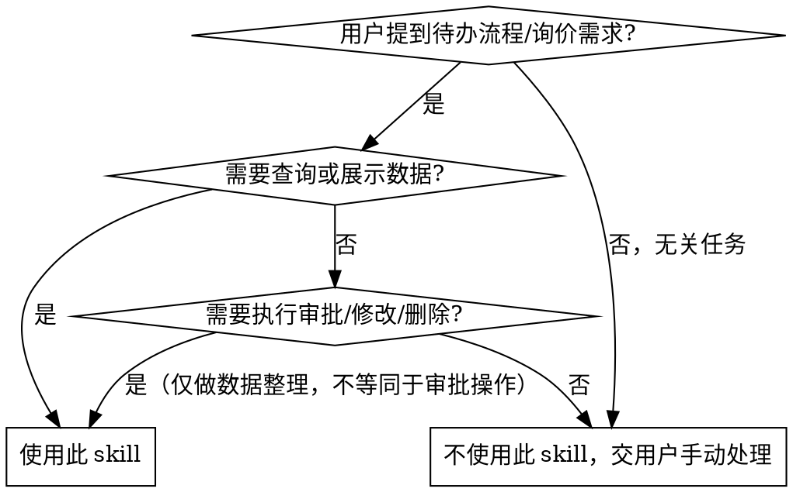

# DMS 非标询价 — 交互式工作流

逐步骤提取 DMS 待办询价流程 → 展示需求请用户确认 → 库存匹配 → 生成 BOM → 填写产品信息。

**关键规则：所有需要用户确认的地方，必须使用 `AskUserQuestion` 工具，不能仅打印到终端等待。****每步均需用户确认，不跳过任何确认环节。**

## 前置依赖

```bash
pip install playwright openpyxl pandas calamine
playwright install chromium
```

首次安装即可，无需重复。

**检测 Chromium 是否已安装：**

```bash
python -c "from playwright.sync_api import sync_playwright; p=sync_playwright().start(); print('✅', p.chromium.executable_path); p.stop()"
```

如果报错，说明 Chromium 未安装，运行 `playwright install chromium` 即可。

## 核心模式（三步确认法）

```
用户触发 → [提取] 拉取待办 → [AskUserQuestion] 用户确认需求
  → [库存匹配] 查库存/算配置 → [AskUserQuestion] 用户确认方案
  → [生成BOM] 输出Excel → [AskUserQuestion] 用户确认BOM
  → [填写产品信息] 提交到DMS
```

**原则：** 每一步都向用户展示结果，**使用 `AskUserQuestion` 工具**获得明确确认后才进行下一步。

## 何时使用 vs 不使用



### 使用
- 用户提到 DMS 待办流程需要处理
- 用户说"看下待办"、"有什么需求"
- 需要生成 BOM 清单（Excel）
- 需要从库存列表匹配物料（组件/逆变器/并网箱）
- 需要在 DMS 产品信息页填写数据
- 用户提到"非标询价"关键词

### 不使用
- 用户要求**审批通过/驳回/删除**流程（必须由用户在浏览器中手动操作）
- 用户要求修改已提交的数据
- 用户要求执行下单、发邮件等写操作
- 场景不涉及 DMS 或待办流程
- 安全约束：**本 skill 仅做查询和数据整理，审批操作必须由用户在 DMS 页面手动完成**

## 步骤概览

| 步骤 | 脚本 | 用户确认点 |
|------|------|-----------|
| 1. 检查登录凭据 | `check_env.py` | — |
| 2. 提取待办流程 | `run_inquiry_extract.py` | 展示待办列表，确认需求 |
| 3. 库存匹配 | `inventory_query.py` + `inverter_config.py` | 确认匹配方案 |
| 4. 生成 BOM | `run_inquiry_bom.py` | 确认 BOM 无误 |
| 5. 填写产品信息 | `fill_product_info.py` | —（填写后浏览器保持打开，供用户手动审批）|

## 执行步骤

### 步骤 0：检查环境

**检查 DMS 凭据 + Chromium 浏览器是否就绪：**

```bash
SKILL_DIR="$(dirname "$(dirname "$(find ~/.claude/skills -name 'run_inquiry_extract.py' 2>/dev/null | head -1)")")"
python "$SKILL_DIR/scripts/check_env.py" --check-browser
```

输出示例：

```
========================================
  浏览器环境检查
========================================
  [Chromium] ✅ Chromium 可执行文件: C:\Users\xxx\AppData\Local\ms-playwright\chromium-xxx\chrome.exe
  ✅ 浏览器环境就绪

DMS_USER=xxx@trinapower.com
DMS_PASSWORD=xxx
SOURCE=bashrc
```

- 如果 Chromium 显示 ❌，**使用 `AskUserQuestion` 询问用户是否要安装**，提供安装命令
- 如果返回 `NOT_FOUND`，**使用 `AskUserQuestion` 向用户展示凭据配置说明**并等待回复

### 步骤 1：提取待办流程

```bash
python "$SKILL_DIR/scripts/run_inquiry_extract.py" --output-file "$PWD/inquiry_data.json"
```

参数：

| 参数 | 说明 | 默认 |
|------|------|------|
| `--headless` | 无头模式 | 显示浏览器 |
| `--workers N` | 并行并发数 | 3 |
| `--output-file PATH` | 输出 JSON 路径 | stdout |

读取 `inquiry_data.json`，**使用 `AskUserQuestion` 向用户展示待办摘要，请用户确认**：

```
待办流程 1: {flow_id}
  项目名称: {project_name}
  代理商: {agent_code} {agent_name}
  省公司: {province}
  业务员: {salesperson}
  BOM清单:
    {code} {name} x {qty} (已指定)
    [待选] {name} x {qty}
  审批意见:
    {node}: "{opinion}"
```

**使用 `AskUserQuestion`** 让用户确认信息是否准确、哪些物料需从库存查找、有无特殊要求。**不要仅打印到终端等待。**

### 步骤 2：库存匹配

对未指定物料编号的项目，使用库存查询脚本：

```bash
# 查询 715W 组件
python "$SKILL_DIR/scripts/inventory_query.py" --type 组件 --power 715

# 查询 50kW 逆变器（天合）
python "$SKILL_DIR/scripts/inventory_query.py" --type 逆变器 --power 50 --brand 天合

# 查并网箱
python "$SKILL_DIR/scripts/inventory_query.py" --type 并网箱 --power 50

# 按品牌分组显示（更直观）
python "$SKILL_DIR/scripts/inventory_query.py" --type 逆变器 --brand 天合 --group-by-brand

# 输出 JSON（供后续脚本处理）
python "$SKILL_DIR/scripts/inventory_query.py" --type 逆变器 --brand 天合 --json

# 刷新缓存
python "$SKILL_DIR/scripts/inventory_query.py" --refresh
```

**如需配置逆变器（组件总功率 ÷ 逆变器总功率 ≤ 1.2，建议 1.1~1.2）：**

```bash
python "$SKILL_DIR/scripts/inverter_config.py" \
  --component-power 572 \
  --existing 100 \
  --brand 天合
```

**匹配优先级规则（按顺序）：**
1. **有库存 > 无库存**：无库存的物料会导致流程卡住
2. **非原厂机 > 原厂机**（除非项目强制）：非原厂机现货充足
3. **同品牌优先**：减少安装调试复杂度
4. **同品牌内选价格排序最低的**

**使用 `AskUserQuestion` 展示库存匹配结果给用户确认方案。**

### 步骤 3：生成 BOM

```bash
python "$SKILL_DIR/scripts/run_inquiry_bom.py" \
  --name "业务员名" \
  --components 30 \
  --items '6B001492:30,AA001653:1' \
  --project "余庆县包装盒厂572kw分布式光伏发电项目" \
  --output-dir "$PWD"
```

`--items` 支持两种格式：

| 格式 | 示例 |
|------|------|
| 简洁格式（推荐） | `6B001492:30,AA001653:1` |
| JSON 格式 | `[["6B001492",30],["AA001653",1]]` |

**使用 `AskUserQuestion` 展示生成的 BOM 文件给用户确认，确认无误后再进行下一步。**

### 步骤 4：填写产品信息（BOM 确认后）

```bash
python "$SKILL_DIR/scripts/fill_product_info.py" \
  --flow-id 2026060310435399 \
  --component-power 715 \
  --component-count 800
```

**⚠️ 此步骤必须在 BOM 确认后执行，不能提前。**

**填写后：** 浏览器保持打开状态，供用户手动检查并点击审批按钮。**不会自动审批，不会自动关闭浏览器。**

## 凭据配置

DMS 登录凭据通过环境变量读取，**不硬编码密码**。

如果 `check_env.py` 返回 `NOT_FOUND`，告诉用户：

```
请先配置 DMS 登录环境变量：

Bash / Git Bash:
  export DMS_USER="your_email@trinapower.com"
  export DMS_PASSWORD="your_password"

PowerShell:
  $env:DMS_USER="your_email@trinapower.com"
  $env:DMS_PASSWORD="your_password"

永久配置：将上述命令添加到 ~/.bashrc（Bash）或 $PROFILE（PowerShell）。
配置完成后回复"已配置"，我将继续执行。
```

## 安全约束

**本 skill 仅执行查询和数据填充操作，严格遵守：**

| 允许 | 禁止 |
|------|------|
| 登录 | 审批通过/驳回 |
| 导航页面 | 提交表单 |
| 筛选查询 | 删除记录 |
| 读取页面内容 | 修改数据 |
| 填写产品信息 | 执行下单 |
| | 发送邮件 |

如页面出现审批、提交、删除等操作按钮，**一律不点击**。如意外跳转到审批/修改页面，立即返回并在终端提示用户。

## 常见错误

| 错误 | 正确做法 |
|------|---------|
| BOM 确认前填写产品信息 | 严格按顺序：提取→确认→库存→确认→BOM→确认→填写 |
| 跳过用户确认直接执行下一步 | 每步都必须使用 `AskUserQuestion` 等待用户明确回复 |
| 仅打印到终端不 AskUserQuestion | 所有确认点必须使用 `AskUserQuestion` 工具，不能仅 print |
| 自动关闭浏览器 | 填写完成后浏览器保持打开，让用户手动检查审批 |
| 忽略库存预警 | 库存不足时提醒用户，让用户决定是否继续 |
| 混品牌方案未提示用户 | 同品牌不满足时，告知用户并列出混合品牌方案供选择 |

## 脚本参考

| 脚本 | 路径 | 用途 |
|------|------|------|
| `check_env.py` | `scripts/check_env.py` | 并行检查 DMS 环境变量 |
| `run_inquiry_extract.py` | `scripts/run_inquiry_extract.py` | 提取待办流程详情到 JSON |
| `inventory_query.py` | `scripts/inventory_query.py` | 查询组件/逆变器/并网箱库存 |
| `inverter_config.py` | `scripts/inverter_config.py` | 自动计算逆变器配置方案 |
| `run_inquiry_bom.py` | `scripts/run_inquiry_bom.py` | 生成 BOM 清单 Excel |
| `fill_product_info.py` | `scripts/fill_product_info.py` | 填写 DMS 产品信息（Element UI） |
| `browser_manager.py` | `scripts/browser_manager.py` | 共享浏览器管理器（单例模式） |

## 示例

**输入：** 待办流程，覃建发提交，30 张 730W 组件 + 50kW 并网箱，物料均已指定
**执行：**

```bash
python "$SKILL_DIR/scripts/run_inquiry_bom.py" \
  --name "覃建发" \
  --components 30 \
  --items '6B001492:30,AA001653:1' \
  --output-dir "$PWD"
```

**输出：** `覃建发30块组件20260528.xlsx`，内容：

```
物料编号 | 数量
6B001492 | 30
AA001653 | 1
```

## 注意事项

- 脚本运行时打开浏览器窗口（除非 `--headless`），**请勿手动操作**
- DMS 页面结构变化可能导致选择器失效，需更新脚本
- 库存数据日期可能过时，告知用户数据截止日期
- 查看脚本详细 API 参考 → `scripts/` 下各脚本的 docstring 和 `--help`
