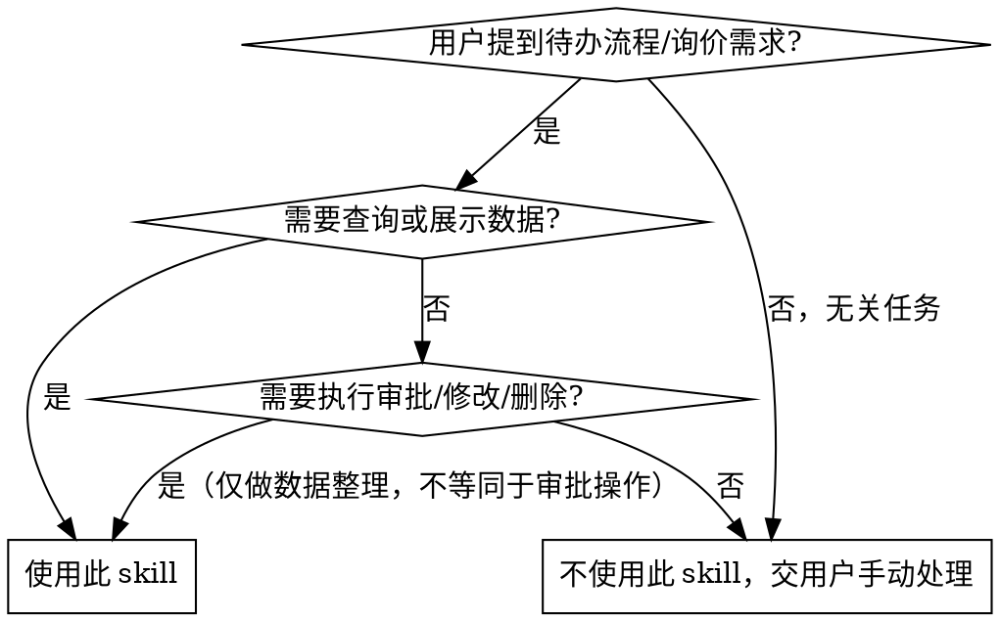

# DMS 非标询价 — 交互式工作流

## 概述

DMS 非标询价工作流：自动提取 DMS 待办流程 → 逐步骤用户确认 → 库存匹配 → 生成 BOM → 填写产品信息。
**核心约束：每一步必须使用 `AskUserQuestion` 确认后才能继续，不允许跳过任何确认环节，不得仅打印到终端等待。**

## 前置依赖

```bash
pip install playwright openpyxl pandas calamine
playwright install chromium
```

首次安装即可，无需重复。

**检测 Chromium 是否已安装：**

```bash
python ~/.claude/skills/dms-inquiry-bom/scripts/dms_credentials.py --check-browser
```

## 核心模式（三步确认法）

```
用户触发 → [提取] 拉取待办 → [AskUserQuestion] 用户确认需求
  → [库存匹配] 查库存/算配置 → [AskUserQuestion] 用户确认方案
  → [生成BOM] 输出Excel → [AskUserQuestion] 用户确认BOM
  → [填写产品信息] 提交到DMS
  → [回顾反馈] 主动询问改进建议 → 根据反馈更新
```

**原则：** 每一步都向用户展示结果，**使用 `AskUserQuestion` 工具**获得明确确认后才进行下一步。

## 何时使用 vs 不使用



### 使用
- 用户提到 DMS 待办流程需要处理
- 用户说"看下待办"、"有什么需求"
- 需要生成 BOM 清单（Excel）
- 需要从库存列表匹配物料（组件/逆变器/并网箱）
- 需要在 DMS 产品信息页填写数据
- 用户提到"非标询价"关键词

### 不使用
- 用户要求**审批通过/驳回/删除**流程（必须由用户在浏览器中手动操作）
- 用户要求修改已提交的数据
- 用户要求执行下单、发邮件等写操作
- 场景不涉及 DMS 或待办流程
- 安全约束：**本 skill 仅做查询和数据整理，审批操作必须由用户在 DMS 页面手动完成**

## 步骤概览

| 步骤 | 脚本 | 用户确认点 |
|------|------|-----------|
| 0. 检查登录凭据 | `dms_credentials.py` | — |
| 1. 提取待办流程 | `run_inquiry_extract.py` | 展示待办列表，确认需求 |
| 2. 库存匹配 | `inventory_query.py` + `inverter_config.py` | 确认匹配方案 |
| 3. 生成 BOM | `run_inquiry_bom.py` | 确认 BOM 无误 |
| 4. 填写产品信息 | `fill_product_info.py` | —（填写后浏览器保持打开，供用户手动审批）|
| 5. 回顾与反馈 | `AskUserQuestion` | 主动询问是否有问题、是否需要优化 skill |

## 执行步骤

### 步骤 0：检查环境

**检查 DMS 凭据 + Chromium 浏览器是否就绪：**

```bash
SKILL_DIR="$HOME/.claude/skills/dms-inquiry-bom"
python "$SKILL_DIR/scripts/dms_credentials.py" --check-browser
```

> ⚠️ 注意：不要使用 `find` 命令动态查找 SKILL_DIR，应直接使用 `~/.claude/skills/dms-inquiry-bom` 路径。skill 已加载时路径一定存在，无需额外检查。

输出示例（Chromium 已安装）：

```
========================================
  浏览器环境检查
========================================
  [Chromium] ✅ 已安装
  ✅ 浏览器环境就绪

DMS_USER=xxx@trinapower.com
DMS_PASSWORD=xxx
SOURCE=bashrc
```

- 如果 Chromium 显示 ❌，**使用 `AskUserQuestion` 询问用户是否要安装**，提供安装命令
- 如果返回 `NOT_FOUND`，**使用 `AskUserQuestion` 向用户展示凭据配置说明**并等待回复

**终端中文乱码修复（Windows Git Bash）：** Windows 环境下 JSON 管道传输中文字符容易出现乱码或 `FileNotFoundError`，推荐三种方案：

**方案一（推荐）：使用 `--output-file` 保存到文件**（脚本支持该参数时优先使用）
```bash
# 查询结果直接写入文件，避免管道编码问题
python "$SKILL_DIR/scripts/inventory_query.py" --file "$INVENTORY_FILE" --type 组件 --power 730 --json --aggregate --output-file "$PWD/query_result.json"
# 再用 Python 读取（确保 UTF-8 编码）
python -c "import json; print(json.dumps(json.load(open(r'$PWD/query_result.json','r',encoding='utf-8')),ensure_ascii=False,indent=2))"
```

**方案二：Python subprocess 调用（无文件残留）**
```python
import subprocess, json
result = subprocess.run(['python', script_path, '--file', inv_file, '--type', '组件', '--json', '--aggregate'], capture_output=True)
data = json.loads(result.stdout.decode('utf-8'))
```

**方案三（旧方案）：管道 + io 重编码（不推荐，仍可能乱码）**
```bash
JSON_FILE="$PWD/inquiry_data.json"
python -c "import json,sys,io;sys.stdout=io.TextIOWrapper(sys.stdout.buffer,encoding='utf-8');print(json.dumps(json.load(open('$JSON_FILE','r',encoding='utf-8')),ensure_ascii=False,indent=2))"
```

### 步骤 1：提取待办流程

```bash
python "$SKILL_DIR/scripts/run_inquiry_extract.py" --output-file "$PWD/inquiry_data.json"
```

参数：

| 参数 | 说明 | 默认 |
|------|------|------|
| `--workers N` | 并行并发数 | 3 |
| `--output-file PATH` | 输出 JSON 路径 | stdout |

读取 `inquiry_data.json`，**使用 `AskUserQuestion` 向用户展示待办摘要，请用户确认**：

```
待办流程 1: {flow_id}
  项目名称: {project_name}
  代理商: {agent_code} {agent_name}
  省公司: {province}
  业务员: {salesperson}
  备注: {remark}
  BOM清单: {bom_items}
  审批历史:
    {node}: {processor} → {status} ({time}) "{opinion}"
```

**⚠️ BOM清单(bom_items)可能为空数组（表示物料均未指定），备注(remark)字段包含关键需求信息。**

**使用 `AskUserQuestion`** 让用户：
1. 确认信息是否准确
2. 选择优先处理哪个流程（多流程时列出所有，让用户选或指定顺序）
3. 哪些物料需从库存查找
4. 有无特殊要求

**不要仅打印到终端等待。**

### 步骤 2：库存匹配

**⚠️ 关键说明 — 库存文件 Excel 结构：**

库存文件包含 3 个标准 sheet，**数据质量不同**：

| Sheet | 用途 | 数据质量 |
|-------|------|---------|
| `组件` | 组件库存，含功率、品牌、备注 | 库存数量可能为 NaN，物料编码有 merged cell 问题 |
| `逆变器` | 逆变器库存，含功率、厂家、备注 | 同上 |
| `并网箱` | 并网箱库存，含类型、功率、备注 | 同上 |

**库存文件位置：** 脚本自动搜索 `assets/` 目录或 skill 根目录，无需手动指定路径。如需指定特定文件，使用 `--file` 参数：

```bash
# 不传 --file 时自动搜索 assets/ 下的库存文件
INVENTORY_FILE=$(ls "$SKILL_DIR"/assets/组件、逆变器、并网箱可用库存统计*.xlsx 2>/dev/null | head -1)
```

**⚠️ 备注字段检查规则（新增 — 必须执行）：**

查询结果中的 **`备注` 字段** 包含影响物料可用性的关键信息，**必须逐条检查**：

| 备注内容 | 含义 | 处理方式 |
|----------|------|---------|
| `江苏华电项目专用` / `河南华电项目专用` | 指定项目专用组件 | **不可用于其他项目**，必须排除 |
| `特价组件` | 特价促销组件 | 可正常使用，但需告知用户 |
| `小包装组件，仅限阳台光伏使用` | 限用途 | **不可用于常规电站** |
| `未上架` | 未上架不可售 | **不可使用** |
| `原厂机` / `原厂机，有现货时交期最快X天...` | 原厂生产，交期长 | **非项目强制要求，尽量不用原厂机**；如使用需确认交期 |
| `常规备货，请关注库存量...` | 常规备货 | 可用，但库存量不足时需询采购交期 |

**⚠️ 非标品类处理规则（新增 — 需求品类不在库存中时）：**

当用户需求中包含 **库存中不存在的品类**（如储能、储能电池、逆变器配件等组件/逆变器/并网箱之外的品类）：

1. **如实告知用户**：说明该品类不在当前库存数据范围内，库存只有组件、逆变器、并网箱三类
2. **提出处理选项**：使用 `AskUserQuestion` 提供以下选项让用户选择：
   - **用户自行采购** — 本次 BOM 不包含该品类，用户另行解决
   - **用户提供型号后尝试查找** — 用户给出具体物料编码/型号，检查是否在库存中
   - **后续再处理** — 先确定已有品类方案
3. **BOM 中标注说明**：在生成 BOM 时可在项目备注中注明缺失品类需另行采购
4. **不强制流程终止**：某一品类不在库存中不等于整个流程终止，继续完成其他可匹配部分

> **原则：** 库存数据范围有限（仅组件/逆变器/并网箱），超出范围的需求应正常告知用户，但不阻塞流程继续。

**重要操作规则：**

1. **聚合所有仓库**：同一物料编码可能分布在多个仓库（贵阳仓、武汉仓等），数量必须加总。不能只看单条记录。
2. **必查备注**：`备注` 字段包含 "江苏华电项目专用"、"未上架"、"原厂机" 等关键限制条件，**筛选后必须逐条检查**，不满足条件的物料必须排除。
3. **必查非标品类**：用户需求中可能包含储能、配件等库存中不存在的品类，按上方"非标品类处理规则"执行。
4. **LLM 调用一律使用 `--json` 格式**（结构化数据便于 LLM 精确解析），不要在命令中省略 `--json`。

**`--output-file` 参数说明：** `inventory_query.py` 支持 `--output-file` 参数将 JSON 结果直接写入文件，**避免 Windows 管道传输中文乱码问题**。在 Linux/Mac 下管道传输无此问题，但仍推荐用 `--output-file` 保证数据完整性。

```bash
# 推荐：直接保存到文件，再用 Python 读取
python "$SKILL_DIR/scripts/inventory_query.py" --file "$INVENTORY_FILE" --type 组件 --power 730 --json --aggregate --output-file "$PWD/query_result.json"
# 然后读取
python -c "import json; data=json.load(open(r'$PWD/query_result.json','r',encoding='utf-8')); print(json.dumps(data,ensure_ascii=False,indent=2))"
```

**查询命令示例（LLM 调用 — 统一使用 --json）：**

```bash
# 查询 715W 组件（聚合所有仓库 + JSON）
python "$SKILL_DIR/scripts/inventory_query.py" --file "$INVENTORY_FILE" --type 组件 --power 715 --json --aggregate

# 查询 50kW 逆变器（天合原装）
python "$SKILL_DIR/scripts/inventory_query.py" --file "$INVENTORY_FILE" --type 逆变器 --power 50 --brand 天合 --json --aggregate

# 查并网箱
python "$SKILL_DIR/scripts/inventory_query.py" --file "$INVENTORY_FILE" --type 并网箱 --power 50 --json --aggregate

# 不聚合（查看各仓库分布明细 + 备注）
python "$SKILL_DIR/scripts/inventory_query.py" --file "$INVENTORY_FILE" --type 组件 --power 715 --json
```

**如需配置逆变器（组件总功率 ÷ 逆变器总功率 ≤ 1.2，建议 1.1~1.2）：**

```bash
python "$SKILL_DIR/scripts/inverter_config.py" \
  --file "$INVENTORY_FILE" \
  --component-power 572 \
  --existing 100 \
  --brand 天合
```

**⚠️ 用户指定物料库存不足时的处理规则（关键）：**

当用户在备注/需求中**指定了具体功率或型号的物料**（如"730W 组件"、"50kW 逆变器"），但库存中该规格物料数量不足时，**严禁擅自决定改用其他功率的物料替代**。必须按以下顺序处理：

1. **如实告知用户当前库存情况**：展示用户指定规格的库存实际可用数量，说明缺口
2. **使用 `AskUserQuestion` 询问用户如何处理**，让用户自由选择，常见选项参考：
   - **用其他功率替代** — 用户同意后，查询相近功率的库存并展示给用户确认
   - **用户自己去申请/解决库存** — 用户自行协调，流程可以继续（如先填 BOM、继续后续步骤）
   - **部分替代 + 部分自筹** — 比如库存有的先用，不足部分用户另想办法
   - **其他用户自定的方案**
3. **仅在用户明确选择替代方案后**，才去查询和推荐替代物料，且替代方案仍需走正常展示→确认流程
4. **用户选择自行解决时，流程不强制终止**，可根据实际情况继续后续步骤（如先生成已有物料的 BOM）

> **原则：** 用户备注中明确指定的规格是需求约束，agent 没有权限擅自放宽约束。只有用户本人能决定如何变通。用户选择自筹物料不等于流程终止，应灵活配合继续推进。

**匹配优先级规则（按顺序）：**
1. **用户指定规格优先**：用户备注/需求中明确指定的功率/型号，必须优先查询和匹配。库存不满足时按上述"处理规则"执行，不得擅自替换。
2. **有库存 > 无库存**：无库存的物料会导致流程卡住
3. **备注检查 > 其他**：有禁用备注（项目专用/未上架等）的物料直接排除，不参与后续比较
4. **同品牌优先**：所选物料尽量统一品牌，减少多品牌混用带来的安装调试和售后复杂度。用户有提及已有设备时优先匹配其品牌；未提及时 agent 自动优先选择同品牌方案，并在展示方案时向用户说明品牌选择逻辑。
5. **非原厂机 > 原厂机**（除非项目强制）：非原厂机现货充足
6. **同品牌内选价格排序最低的**

**展示匹配方案给用户确认时，必须包含：**
- ✅ 每个物料的**多仓库库存汇总**
- ✅ **备注/预警信息**（如"未上架"、"原厂机交期30天"等），让用户知晓限制条件
- ✅ 逆变器 DC/AC 比值
- ✅ 如排除了备注受限物料，说明排除原因

### 步骤 3：生成 BOM

```bash
python "$SKILL_DIR/scripts/run_inquiry_bom.py" \
  --name "业务员名" \
  --components 120 \
  --items '6B001440:120,AA002415:4,AB001161:1' \
  --project "织金张先生" \
  --output-dir "$PWD"
```

`--items` 支持两种格式：

| 格式 | 示例 |
|------|------|
| 简洁格式（推荐） | `6B001492:30,AA001653:1` |

**使用 `AskUserQuestion` 展示生成的 BOM 文件给用户确认，确认无误后再进行下一步。**

### 步骤 4：填写产品信息（BOM 确认后）

```bash
python "$SKILL_DIR/scripts/fill_product_info.py" \
  --flow-id 2026060519454266 \
  --component-power 715 \
  --component-count 120

# 同时填写逆变器信息
python "$SKILL_DIR/scripts/fill_product_info.py" \
  --flow-id 2026060519454266 \
  --component-power 715 \
  --component-count 120 \
  --inverter-power 50 \
  --inverter-count 1

# 同时填写逆变器和并网箱
python "$SKILL_DIR/scripts/fill_product_info.py" \
  --flow-id 2026060519454266 \
  --component-power 715 \
  --component-count 120 \
  --inverter-power 50 \
  --inverter-count 1 \
  --box-power 50 \
  --box-count 1
```

**⚠️ 此步骤必须在 BOM 确认后执行，不能提前。**

**填写后：** 浏览器保持打开状态，供用户手动检查并点击审批按钮。**不会自动审批，不会自动关闭浏览器。**

### 步骤 5：回顾与反馈（流程完成后）

当前流程的 BOM 生成和产品信息填写完成后（或流程因缺库存等问题卡住时），**agent 主动自我反思本次执行过程**：

**反思清单：**
1. 本次执行中遇到了哪些问题（脚本报错、数据异常、流程卡住）？
2. 当前 SKILL.md 的说明是否能覆盖这些场景？
3. 脚本是否有 bug 或功能缺失？
4. 用户操作过程中有哪些可以优化的交互点？

**流程结束前必须执行 — 清理临时文件：**

执行过程中 agent 可能在工作目录下生成了临时 JSON 文件（如 `inquiry_data.json`、`inv.json` 等查询缓存），**在流程结束后必须主动清理**：

1. 列出本次生成的所有非交付物文件（JSON 缓存、中间数据等）
2. 使用 `rm -f` 删除，确认删除成功
3. **BOM 文件（`.xlsx`）属于交付物，不删除**，除非用户明确要求

> **原则：** 临时 JSON 文件是查询中间产物，BOM Excel 是最终交付物。只清理 JSON 缓存，保留 BOM。

**将反思结果提炼为具体优化建议，使用 `AskUserQuestion` 主动向用户提出：**

```markdown
AskUserQuestion:
  "本次流程执行中发现了以下问题，建议优化：
   1. [问题1] → 建议 [优化方案]
   2. [问题2] → 建议 [优化方案]
   您是否有补充？确认后我将更新 SKILL.md。"
```

**根据用户确认/补充后：**
- ✅ 更新 SKILL.md 中的说明、注意事项、常见错误
- ✅ 记录到 memory 供下次会话参考
- ✅ 如涉及脚本 bug，更新脚本待修复清单

> **原则：** 先自行反思提炼，再给用户确认补充，而不是空泛地问"有没有要改进的"。

## 多流程处理策略

当提取到多条待办流程时：

1. **一次性展示全部流程摘要**给用户
2. **让用户选择优先处理哪个**（使用 AskUserQuestion 提供选项）
3. 当前流程处理完毕后（或卡住时），**询问是否继续处理下一个**
4. 已处理的流程标记状态，避免重复

## 凭据配置

DMS 登录凭据通过环境变量读取，**不硬编码密码**。检测逻辑集中在 `scripts/dms_credentials.py`，各业务脚本共用（也可直接 CLI 运行 `dms_credentials.py --check-browser` 检查环境）。

检测顺序：当前环境变量 → shell profile（先直读 `export`，再 bash 兜底）→ PowerShell 用户变量。

如果 `dms_credentials.py` 返回 `NOT_FOUND`，告诉用户：

```
请先配置 DMS 登录环境变量：

Bash / Git Bash:
  export DMS_USER="your_email@trinapower.com"
  export DMS_PASSWORD="your_password"

PowerShell:
  $env:DMS_USER="your_email@trinapower.com"
  $env:DMS_PASSWORD="your_password"

永久配置：将上述命令添加到 ~/.bashrc（Bash）或 $PROFILE（PowerShell）。
配置完成后回复"已配置"，我将继续执行。
```

## 安全约束

**本 skill 仅执行查询和数据填充操作，严格遵守：**

| 允许 | 禁止 |
|------|------|
| 登录 | 审批通过/驳回 |
| 导航页面 | 提交表单 |
| 筛选查询 | 删除记录 |
| 读取页面内容 | 修改数据 |
| 填写产品信息（仅填写字段，不点击审批/提交按钮） | 执行下单 |

如页面出现审批、提交、删除等操作按钮，**一律不点击**。如意外跳转到审批/修改页面，立即返回并在终端提示用户。

## 异常处理

执行过程中遇到脚本报错时，按以下策略处理：

| 场景 | 处理方式 |
|------|---------|
| `--check-browser` 报 Chromium 未安装 | **安装后重试**：使用 `AskUserQuestion` 询问用户是否运行 `playwright install chromium` |
| 凭据返回 `NOT_FOUND` | **展示配置说明**：使用 `AskUserQuestion` 向用户展示凭据配置步骤 |
| 提取/库存/BOM 脚本报错 | **重试 1 次**：检查参数是否正确，修复后重试。再次失败则**使用 `AskUserQuestion` 告知用户错误信息，询问是否跳过该步骤继续** |
| 填写产品信息脚本报错 | **不重试**：直接使用 `AskUserQuestion` 告知用户，说明可手动在 DMS 页面操作 |
| 待办流程提取数为 0 | **不报错**：正常展示结果，执行回顾环节，询问是否继续或退出 |
| 用户中途要求中断流程 | **停止当前步骤**：清理浏览器资源，执行回顾环节 |

> **原则：** 脚本报错时优先展示原始错误信息给用户，不要自行修改用户配置或凭据。

## 常见错误

| 错误 | 正确做法 |
|------|---------|
| BOM 确认前填写产品信息 | 严格按顺序：提取→确认→库存→确认→BOM→确认→填写 |
| 跳过用户确认直接执行下一步 | 每步都必须使用 `AskUserQuestion` 等待用户明确回复 |
| 仅打印到终端不 AskUserQuestion | 所有确认点必须使用 `AskUserQuestion` 工具，不能仅 print |
| 自动关闭浏览器 | 填写完成后浏览器保持打开，让用户手动检查审批 |
| 忽略库存预警 | 库存不足、停止排产等预警必须展示给用户，让用户决定是否继续 |
| 混品牌方案未提示用户 | 同品牌不满足时，告知用户并列出混合品牌方案供选择 |

## 脚本参考

| 脚本 | 路径 | 用途 |
|------|------|------|
| `dms_credentials.py` | `scripts/dms_credentials.py` | 凭据/Chromium 检测 + CLI 环境检查 |
| `run_inquiry_extract.py` | `scripts/run_inquiry_extract.py` | 提取待办流程详情到 JSON |
| `inventory_query.py` | `scripts/inventory_query.py` | 查询组件/逆变器/并网箱库存 |
| `inverter_config.py` | `scripts/inverter_config.py` | 自动计算逆变器配置方案 |
| `run_inquiry_bom.py` | `scripts/run_inquiry_bom.py` | 生成 BOM 清单 Excel |
| `fill_product_info.py` | `scripts/fill_product_info.py` | 填写 DMS 产品信息（Element UI） |
| `browser_manager.py` | `scripts/browser_manager.py` | 共享浏览器管理器（单例模式，供其他脚本内部调用） |

## 示例

**输入：** 待办流程，覃建发提交，30 张 730W 组件 + 50kW 并网箱，物料均已指定
**执行：**

```bash
SKILL_DIR="$HOME/.claude/skills/dms-inquiry-bom"
python "$SKILL_DIR/scripts/run_inquiry_bom.py" \
  --name "覃建发" \
  --components 30 \
  --items '6B001492:30,AA001653:1' \
  --output-dir "$PWD"
```

**输出：** `覃建发30块组件20260528.xlsx`，内容：

```
物料编号 | 数量
6B001492 | 30
AA001653 | 1
```

## 注意事项

- 脚本运行时打开浏览器窗口，**请勿手动操作**
- DMS 页面结构变化可能导致选择器失效，需更新脚本
- 库存数据日期可能过时，告知用户数据截止日期
- 查看脚本详细 API 参考 → `scripts/` 下各脚本的 docstring 和 `--help`
- **待办为 0 时 `--output-file` 不会生成文件**，脚本需处理 `FileNotFoundError` 并友好提示
- **无待办时仍需执行回顾环节**，向用户说明结果并询问是否继续或退出
- **流程结束前清理临时文件**：执行中生成的 JSON 中间文件（如 `inquiry_data.json`、`inv.json`）需在回顾环节主动删除，避免工作目录堆积。BOM 文件（`.xlsx`）属于交付物保留不删。
