# 库存编排器 — 组合编排逻辑说明

> 对应文件：`scripts/inventory_orchestrator.py`

---

## 目录

1. [整体架构](#1-整体架构)
2. [主流程 `run_analysis()`](#2-主流程-run_analysis)
3. [备注过滤系统](#3-备注过滤系统)
4. [组件查询 `query_components_section()`](#4-组件查询-query_components_section)
5. [逆变器查询 `query_inverters_section()`](#5-逆变器查询-query_inverters_section)
6. [品牌分组与物料偏好](#6-品牌分组与物料偏好)
7. [组合方案生成（四步填充法）](#7-组合方案生成四步填充法)
8. [并网柜查询 `query_boxes_section()`](#8-并网柜查询-query_boxes_section)
9. [数据流汇总](#9-数据流汇总)
10. [输入输出参数](#10-输入输出参数)

---

## 1. 整体架构

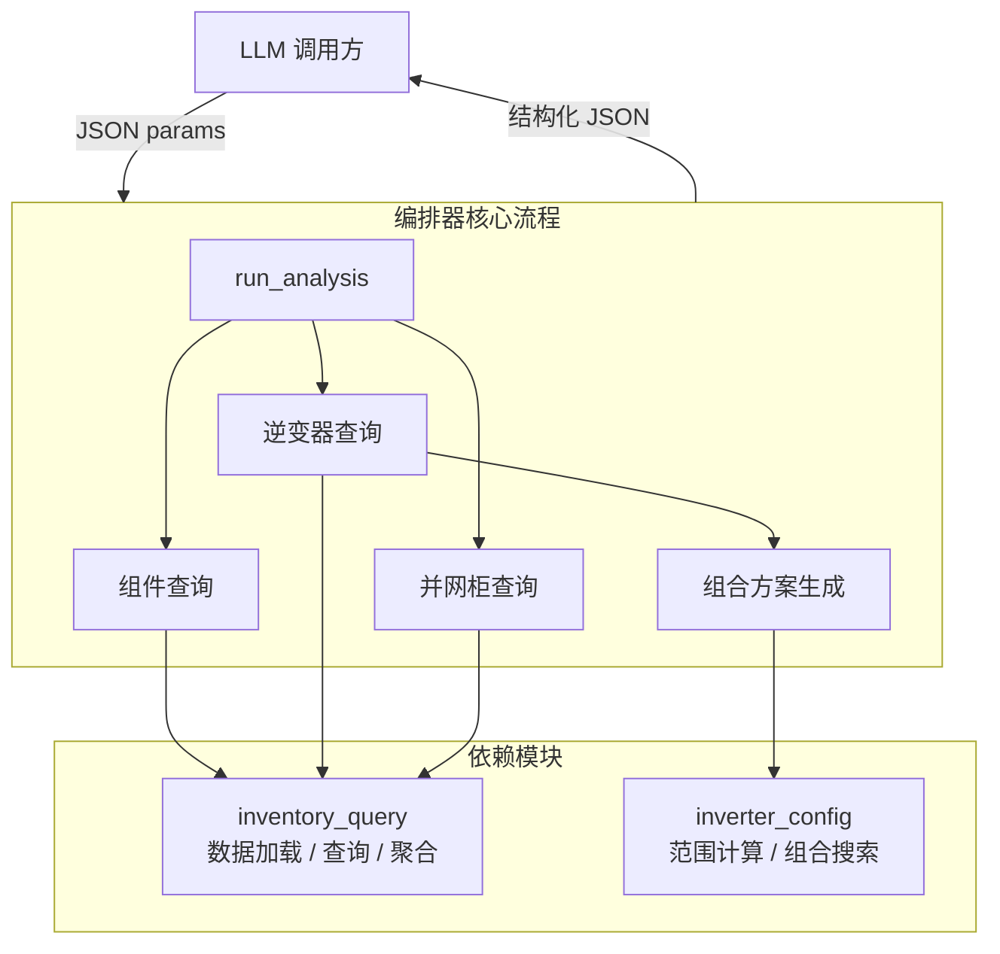

**设计原则：** 纯确定性逻辑，所有计算不依赖 LLM，结果完全可复现。LLM 只需传入结构化 JSON 参数，读取 JSON 分析结果做最终判断。

---

## 2. 主流程 `run_analysis()`

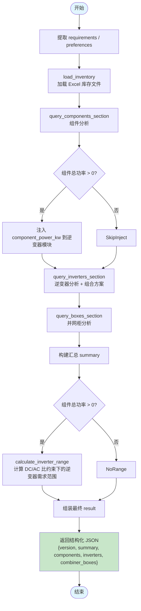

### 汇总字段说明

```json
{
  "summary": {
    "component_power_kw": 584.0,           // 组件总功率 (kW)
    "component_qty": 800,                   // 组件数量
    "component_power_w": 730,               // 单块组件功率 (W)
    "component_status": "sufficient",       // sufficient / insufficient / no_stock
    "existing_inverter_kw": 40,             // 已有逆变器总功率
    "inverter_need_min_kw": 446.7,          // 需要新购的最小逆变器功率
    "inverter_need_max_kw": 490.9,          // 需要新购的最大逆变器功率
    "total_inverter_target_kw": 468.8       // 推荐新购功率（平均值）
  }
}
```

---

## 3. 备注过滤系统

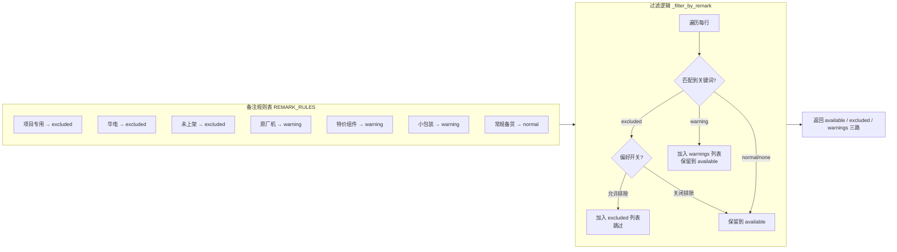

### 排除开关（preferences 控制）

| 关键词 | 开关 | 默认 | behavior |
|--------|------|------|----------|
| 项目专用、华电 | `exclude_project_specific` | `true` | `true`=排除，`false`=保留 |
| 未上架 | `exclude_unlisted` | `true` | `true`=排除，`false`=保留 |
| 原厂机 | `prefer_non_original` | `true` | `true`=排除，`false`=保留+警告 |
| 特价组件 | — | — | 始终保留，仅记录警告 |
| 小包装 | — | — | 始终保留，仅记录警告 |

---

## 4. 组件查询 `query_components_section()`

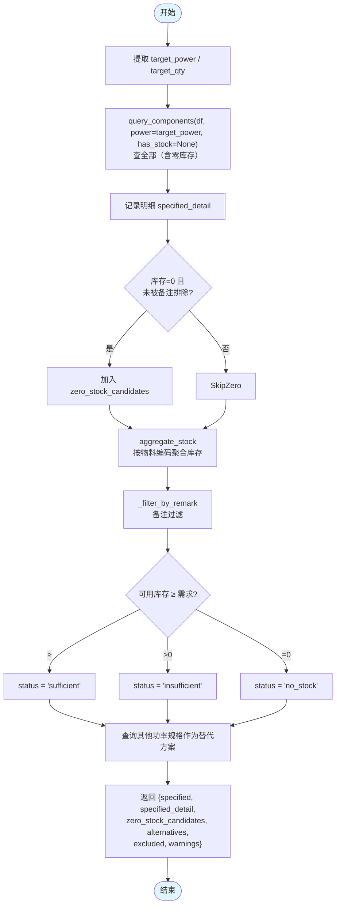

### 替代方案扫描逻辑

对所有不同于指定功率的规格（按功率降序），逐一遍历：

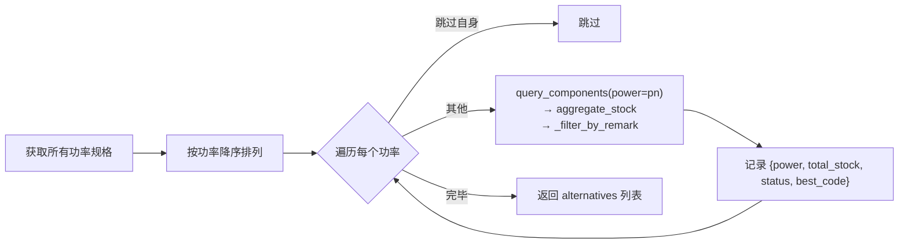

---

## 5. 逆变器查询 `query_inverters_section()`

### 5.1 整体流程

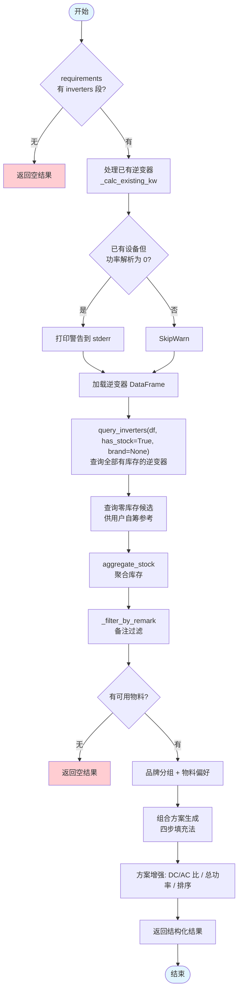

### 5.2 已有逆变器功率解析

支持多种输入格式：

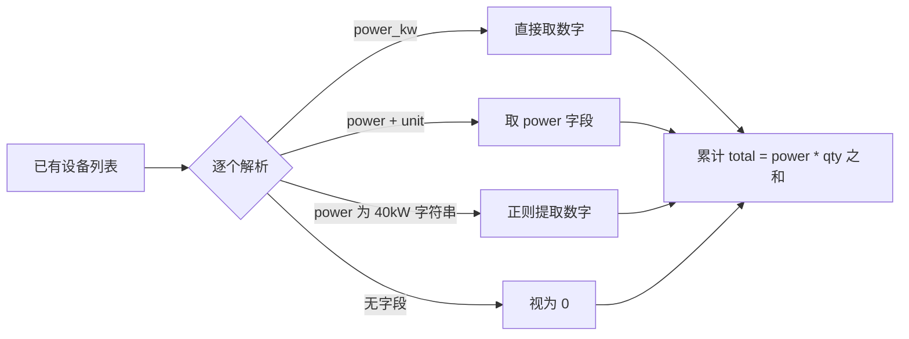

### 5.3 零库存候选

> **条件：** 匹配需求功率/品牌、库存为 0、未被备注排除（不可用的直接过滤）

```
场景 1: required_new 指定 → 按指定功率+品牌查零库存型号
场景 2: 未指定 required_new → 按首选品牌查零库存型号
                                ↓
                     聚合 + 过滤 remark → 收集零库存候选
```

---

## 6. 品牌分组与物料偏好

> 注意：`aggregate_stock()` 聚合后丢弃 `厂家`、`功率`、`备注` 等列，品牌分组**必须用原始 `items` DataFrame**。

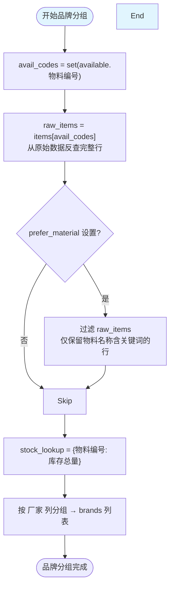

### 输出结构示例

```json
{
  "brands": [
    {
      "name": "上能",
      "models": [
        {"code": "INV001", "power": 40, "name": "上能40kW", "stock": 5, "brand": "上能"},
        {"code": "INV003", "power": 50, "name": "上能50kW", "stock": 3, "brand": "上能"}
      ]
    },
    {
      "name": "华为",
      "models": [{"code": "INV002", "power": 40, "name": "华为40kW", "stock": 8, "brand": "华为"}]
    }
  ]
}
```

> **`prefer_material`** 在品牌分组前完成前置过滤：若设置，`raw_items` 在分组前已按物料名称关键词过滤，后续品牌分组和组合搜索均只包含匹配的型号。

---

## 7. 组合方案生成（四步填充法）

这是编排器中最复杂的逻辑。核心策略是**分步填充**，优先级递减：

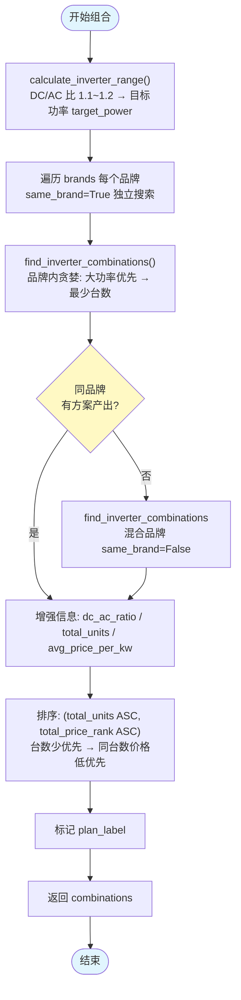

### 组合优先级

| 阶段 | 名称 | 数据来源 | same_brand | 触发条件 |
|------|------|---------|-----------|---------|
| **1** | 同品牌方案 | `brands` 每个品牌各自的型号 | `True` | 始终执行，每个品牌独立搜索 |
| **2** | 混合品牌方案 | 全量（`raw_items_filtered`） | `False` | 仅当阶段 1 无任何方案时触发 |

**终止条件：** 阶段 1 任一品牌产出方案 → 直接输出，不再执行阶段 2。

### 单台方案补充逻辑

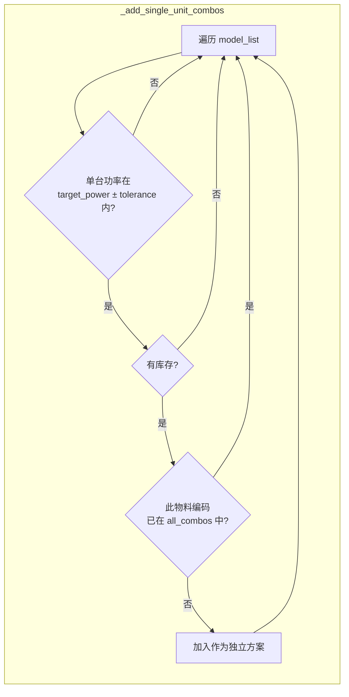

### 组合排序规则

```
主要排序: total_price_rank（总价序，低→高）
次要排序: total_units（设备台数，少→多）

即：同等价格下，用更少设备台数完成需求的方案排在前面
```

---

## 8. 并网柜查询 `query_boxes_section()`

```mermaid
flowchart TD
    Start([开始]) --> Req[提取 requirements.combiner_boxes]
    Req --> Power["box_power = box_req.get('power', 50)<br/>默认 50kW，支持自定义"]

    Power --> DF{并网箱 DataFrame<br/>有数据?}
    DF -->|无| Empty[返回空结果]

    DF -->|有| Query["query_boxes(df, power=box_power, has_stock=True)"]
    Query --> HasStock{有库存?}
    HasStock -->|无| Empty

    HasStock -->|有| Agg[aggregate_stock]
    Agg --> Build[构建 available 列表<br/>{type, code, name, stock}]
    Build --> Return["返回 {existing, available}"]
    Return --> End([结束])

    style Start fill:#e1f5fe
    style End fill:#e1f5fe
    style Empty fill:#ffcdd2
```

---

## 9. 数据流汇总

### 整体数据流

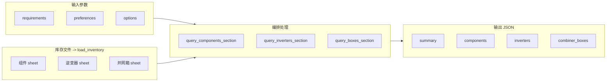

### 逆变器数据血缘

> 理解各阶段 DataFrame 包含哪些列，是正确理解编排逻辑的关键。

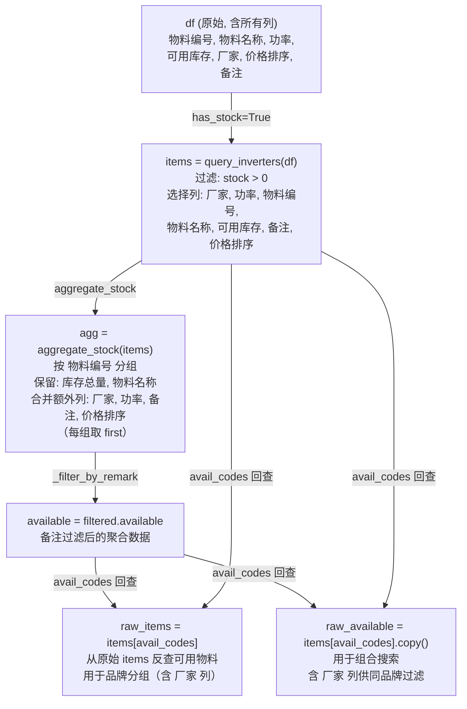

---

## 10. 输入输出参数

### 输入参数

| 层级 | 字段 | 类型 | 必填 | 默认 | 说明 |
|------|------|------|------|------|------|
| `requirements.components` | `power` | int | 是 | — | 组件功率 (W) |
| `requirements.components` | `qty` | int | 是 | — | 组件数量 |
| `requirements.inverters` | `existing` | list | 否 | `[]` | 已有逆变器列表 |
| `requirements.inverters.existing[]` | `model` | string | 否 | — | 型号名 |
| `requirements.inverters.existing[]` | `power_kw` | float | 推荐 | — | 单台功率 (kW) |
| `requirements.inverters.existing[]` | `power` | float/string | 备选 | — | `40` 或 `"40kW"` |
| `requirements.inverters.existing[]` | `qty` | int | 否 | 1 | 数量 |
| `requirements.inverters.existing[]` | `brand` | string | 否 | — | 品牌 |
| `requirements.inverters` | `required_new` | list | 否 | `[]` | 需求新购型号（用于零库存候选） |
| `requirements.combiner_boxes` | `existing` | list | 否 | `[]` | 已有并网柜列表 |
| `requirements.combiner_boxes` | `power` | int | 否 | `50` | 目标并网柜功率 (kW) |
| `preferences` | `prefer_brand` | string | 否 | — | 首选品牌（厂家列） |
| `preferences` | `prefer_material` | string | 否 | — | 物料偏好关键词（前置过滤，物料名称列匹配） |
| `preferences` | `exclude_project_specific` | bool | 否 | `true` | 排除项目专用物料 |
| `preferences` | `exclude_unlisted` | bool | 否 | `true` | 排除未上架物料 |
| `preferences` | `prefer_non_original` | bool | 否 | `true` | 优先非原厂机 |
| `preferences` | `dc_ac_ratio_range` | [float,float] | 否 | `[1.1, 1.2]` | DC/AC 比范围 |
| `preferences` | `stock_sufficient` | bool | 否 | `true` | 只推荐库存充足的方案 |
| `options` | `max_combinations` | int | 否 | `5` | 最多返回组合数 |
| `options` | `tolerance` | float | 否 | `0.15` | 组合功率容差 (15%) |

### 输出结构

```json
{
  "version": "1.0",
  "timestamp": null,
  "summary": {
    "component_power_kw": 584.0,
    "component_qty": 800,
    "component_power_w": 730,
    "component_status": "sufficient | insufficient | no_stock",
    "existing_inverter_kw": 40.0,
    "inverter_need_min_kw": 446.7,
    "inverter_need_max_kw": 490.9,
    "total_inverter_target_kw": 468.8,
    "existing_inverter_detail": "上能40kW x 1"    // 仅在有已有逆变器时
  },
  "components": {
    "specified": {
      "power": 730, "qty": 800, "total_kw": 584.0,
      "available_stock": 800, "status": "sufficient",
      "shortfall": 0
    },
    "specified_detail": [                 // 全部明细（含零库存）
      {"code": "6B001492", "name": "...", "stock": 500, "remark": null, "warehouse": "南宁仓"}
    ],
    "zero_stock_candidates": [...],       // 零库存但可用的候选
    "alternatives": [                     // 其他功率规格
      {"power": 715, "total_stock": 200, "status": "insufficient", "best_code": "..."}
    ],
    "excluded": [...],
    "warnings": [...]
  },
  "inverters": {
    "existing": [{"model": "上能40kW", "power_kw": 40, "qty": 1, "brand": "上能"}],
    "existing_total_kw": 40.0,
    "zero_stock_candidates": [...],
    "preferred_brand": {                  // 设置了 prefer_brand 时
      "name": "上能",
      "models": [{"code": "...", "power": 40, "name": "...", "stock": 5, "brand": "上能"}]
    },
    "preferred_material": {               // 设置了 prefer_material 时
      "keyword": "天合原装专用",
      "models": [                         // 物料保留实际品牌
        {"code": "...", "brand": "上能", "name": "天合原装专用40kW", ...},
        {"code": "...", "brand": "华为", "name": "天合原装专用40kW", ...}
      ]
    },
    "other_brands": [
      {"name": "华为", "models": [...]}
    ],
    "combinations": [
      {
        "plan_label": "方案1",
        "total_power": 440.0,
        "total_price_rank": 3,
        "brand": "天合原装",               // 物料偏好方案的 brand 标签
        "is_material_preferred": true,     // 物料偏好方案标记
        "dc_ac_ratio": 1.2,
        "total_inverter_kw": 480.0,
        "total_units": 2,
        "avg_price_per_kw": 0.01,
        "items": [
          {"code": "...", "power": 40, "quantity": 11, "subtotal": 440,
           "price_rank": 3, "brand": "上能"}
        ]
      }
    ],
    "excluded": [...],
    "warnings": [...]
  },
  "combiner_boxes": {
    "existing": [{"power_kw": 50, "qty": 2}],
    "available": [
      {"type": "并网柜", "code": "...", "name": "...", "stock": 10, "total_stock": 10}
    ]
  }
}
```

---

## 修订历史

| 日期 | 变更 | 说明 |
|------|------|------|
| 2026-06-12 | 初始版本 | workflow 逻辑说明 |
| 2026-06-12 | 新增 `prefer_material` | 物料偏好参数，与品牌正交；修复品牌分组用原始 DataFrame 而非聚合数据 |
