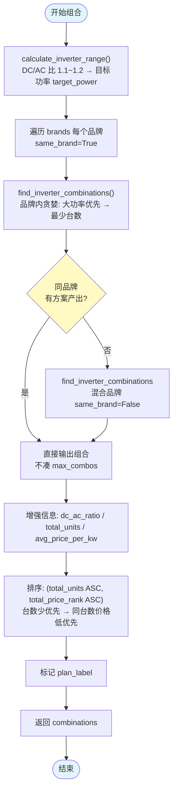
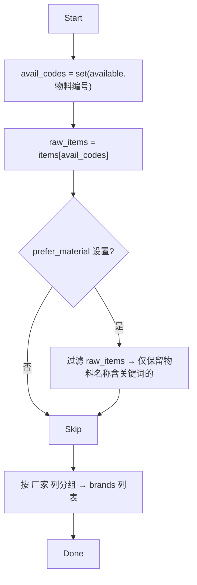

# 逆变器组合编排逻辑修正 Implementation Plan

> **For agentic workers:** REQUIRED SUB-SKILL: Use superpowers:subagent-driven-development (recommended) or superpowers:executing-plans to implement this plan task-by-task. Steps use checkbox (`- [ ]`) syntax for tracking.

**Goal:** 重写编排器中逆变器组合生成的核心算法，将 `prefer_material` 改为前置过滤、移除品牌特权、同品牌优先且不硬凑方案数、排序改为台数优先+价格次之。

**Architecture:** 修改 `inventory_orchestrator.py` 中 `query_inverters_section()` 的组合生成部分，删除步骤 0（物料偏好独立组合），将 `prefer_material` 改为品牌分组前过滤 `raw_available`；组合流程简化为"所有品牌各自 same_brand→兜底 mixed"两段式，同品牌有结果即终止；排序键改为 `(total_units, total_price_rank)`。配套更新测试。

**Tech Stack:** Python 3.11, pandas, inventory_query, inverter_config

---

## 文件结构

| 文件 | 操作 | 说明 |
|------|------|------|
| `scripts/inventory_orchestrator.py` | 修改 | 重写组合生成逻辑：删除步骤 0、`_add_single_unit_combos`、`preferred_brand`/`other_brands` 特权，改为所有品牌平等待遇 |
| `tests/test_inventory_orchestrator.py` | 修改 | 更新 `prefer_material` 相关测试，新增组合逻辑测试 |
| `docs/orchestrator-flow.md` | 修改 | 同步更新流程图 |

---

### Task 1: 修改品牌分组逻辑 — 取消品牌特权

**Files:**
- Modify: `scripts/inventory_orchestrator.py:479-541`

**变更说明：** 当前 `preferred_brand` 把指定品牌弹出优先处理（特权），`other_brands` 轮后。改为所有品牌平等待遇——每个品牌各自 `same_brand=True` 搜索，结果统一集中。

- [ ] **Step 1: 删除 `preferred_brand` 特权逻辑**

当前代码（L511-517）：
```python
    # 设置首选品牌（纯品牌过滤，与物料属性正交）
    if preferred_brand_name:
        if preferred_brand_name in brand_groups:
            result['preferred_brand'] = {
                'name': preferred_brand_name,
                'models': brand_groups.pop(preferred_brand_name),
            }

    # 其他品牌
    for brand, models in sorted(brand_groups.items()):
        result['other_brands'].append({'name': brand, 'models': models})
```

改为：
```python
    # 所有品牌平等待遇（不再有 preferred_brand 特权）
    for brand, models in sorted(brand_groups.items()):
        result['brands'].append({'name': brand, 'models': models})
```

同时修改 `query_inverters_section` 的 `result` 初始化字典，将 `'preferred_brand': None` 和 `'other_brands': []` 合并为 `'brands': []`。

- [ ] **Step 2: 更新 `result` 初始化**

当前（L366-376）：
```python
    result = {
        'existing': [],
        'zero_stock_candidates': [],
        'preferred_brand': None,
        'other_brands': [],
        'combinations': [],
        'excluded': [],
        'warnings': []
    }
```

改为：
```python
    result = {
        'existing': [],
        'zero_stock_candidates': [],
        'brands': [],
        'combinations': [],
        'excluded': [],
        'warnings': []
    }
```

- [ ] **Step 3: 同时删除 `preferred_material` 的收集展示**

当前（L523-541）的 `preferred_material` 收集代码改为移到**品牌分组之前**（见 Task 2）。

当前收集逻辑是在品牌分组之后扫描各品牌组的 model，需要提前到 `raw_available` 阶段。

- [ ] **Step 4: 提交**

```bash
git add scripts/inventory_orchestrator.py
git commit -m "refactor(inventory): 取消 prefer_brand 品牌特权，所有品牌平等待遇"
```

---

### Task 2: `prefer_material` 改为前置过滤

**Files:**
- Modify: `scripts/inventory_orchestrator.py:479-541`（品牌分组前插入）

**变更说明：** 当前 `prefer_material` 是步骤 0 的独立组合，改为在品牌分组前对 `raw_available` 进行筛选，被筛掉的物料仍然进入品牌分组（只影响后续组合搜索时的数据范围）。

- [ ] **Step 1: 在品牌分组前插入 `prefer_material` 过滤**

在 L479（品牌分组开始前）插入：

```python
    # ── 物料偏好过滤（前置筛子，如"天合原装专用"） ──
    # 只影响后续组合的候选物料范围，不改变品牌分组逻辑
    prefer_material = preferences.get('prefer_material')
    raw_items_filtered = raw_items  # 默认不筛选
    if prefer_material:
        keyword = prefer_material
        matched_codes = set()
        for _, row in raw_items.iterrows():
            name = str(row.get('物料名称', ''))
            if keyword in name:
                matched_codes.add(row['物料编号'])
        if matched_codes:
            raw_items_filtered = raw_items[raw_items['物料编号'].isin(matched_codes)]
            result['preferred_material'] = {
                'keyword': keyword,
                'total_count': len(matched_codes),
            }
```

注意此处的 `raw_items_filtered` 将用于后续品牌分组和组合搜索的数据源。

- [ ] **Step 2: 修改品牌分组数据源**

将品牌分组的遍历数据源从 `raw_items` 改为 `raw_items_filtered`：

```python
    for _, row in raw_items_filtered.iterrows():  # 原来用 raw_items
        ...
```

这样设置了 `prefer_material` 时，品牌分组只包含符合条件的物料；没设置时 `raw_items_filtered = raw_items`，行为不变。

- [ ] **Step 3: 删除旧的 `preferred_material` 收集展示代码**

删除 L523-541 的：
```python
    # 物料偏好（如"天合原装专用"）— 与品牌正交...
    if prefer_material:
        ...
```

- [ ] **Step 4: 提交**

```bash
git add scripts/inventory_orchestrator.py
git commit -m "feat(inventory): prefer_material 改为前置过滤，不再作为独立组合步骤"
```

---

### Task 3: 重写组合方案生成算法

**Files:**
- Modify: `scripts/inventory_orchestrator.py:543-708`

**变更说明：** 这是核心改动。组合流程从"四步填充法"改为"两段式"：

```
新的组合流程：
  所有品牌各自 same_brand=True → 收集结果
  如果有任何 same_brand 结果 → 直接输出（不凑数）
  如果 same_brand 结果为空 → 尝试 mixed 兜底
  
  排序: (total_units ASC, total_price_rank ASC)
```

删除：
- `_add_single_unit_combos` 内嵌函数
- 步骤 0（物料偏好独立组合）
- 步骤 1（首选品牌特权）
- 步骤 2（其他品牌轮询）
- 步骤 3（混合品牌补充）

- [ ] **Step 1: 删除 `_add_single_unit_combos` 和 `stock_sufficient_override`**

从 L577-640 整段删除：
```python
        # 生成单台方案的辅助函数
        def _add_single_unit_combos(...):
            ...

        stock_sufficient_override = preferences.get('stock_sufficient', True)

        # 步骤 0：物料偏好方案 ...
        if result.get('preferred_material'):
            ...

        if result['preferred_brand']:
            ...
```

替换为全新的组合逻辑：

```python
        stock_sufficient = preferences.get('stock_sufficient', True)

        # ── 组合生成：所有品牌各自 same_brand → 不足时混合兜底 ──
        all_combos = []

        # 第 1 段：同品牌组合（所有品牌平等待遇）
        for brand_entry in result.get('brands', []):
            brand_name = brand_entry['name']
            brand_raw = raw_available_filtered[raw_available_filtered['厂家'] == brand_name]
            if brand_raw.empty:
                continue
            combos = find_inverter_combinations(
                brand_raw, target_power, tolerance,
                max_combos, same_brand=True,
                stock_sufficient=stock_sufficient,
            )
            for combo_data in combos:
                formatted = format_combination(combo_data)
                all_combos.append(formatted)

        # 同品牌有结果 → 直接输出，不凑数
        if all_combos:
            result['combinations'] = all_combos
            return result

        # 第 2 段：混合品牌兜底（仅当同品牌无任何方案时）
        combos = find_inverter_combinations(
            raw_available_filtered, target_power, tolerance,
            max_combos, same_brand=False,
            stock_sufficient=stock_sufficient,
        )
        for combo_data in combos:
            formatted = format_combination(combo_data)
            all_combos.append(formatted)

        if not all_combos:
            return result
```

注意：`raw_available_filtered` 是基于 `prefer_material` 过滤后的数据源（由 Task 2 提供）。

- [ ] **Step 2: 修改结果增强和排序**

删除旧的排序逻辑（L690-708），替换为：

```python
        # 增强组合信息
        existing_total = existing_kw
        for combo in all_combos:
            total_inv = existing_total + combo['total_power']
            combo['dc_ac_ratio'] = _calc_dc_ac_ratio(component_kw, total_inv)
            combo['total_inverter_kw'] = total_inv
            combo['total_units'] = sum(item['quantity'] for item in combo['items'])
            combo['avg_price_per_kw'] = round(
                combo['total_price_rank'] / combo['total_power'], 2
            ) if combo['total_power'] > 0 else 999

        # 排序：台数少优先 → 同台数时价格低优先
        all_combos.sort(key=lambda c: (c['total_units'], c['total_price_rank']))

        # 添加方案标签
        for i, combo in enumerate(all_combos, 1):
            combo['plan_label'] = f"方案{i}"

        result['combinations'] = all_combos
```

- [ ] **Step 3: 提交**

```bash
git add scripts/inventory_orchestrator.py
git commit -m "refactor(inventory): 重写组合生成算法 — 同品牌优先不凑数，排序改台数优先"
```

---

### Task 4: 清理不再使用的变量和逻辑

**Files:**
- Modify: `scripts/inventory_orchestrator.py`

**变更说明：** 删除 `preferred_brand_name` 变量（因为不再需要从 preferences 读取它用于品牌特权），清理 `raw_available` 相关重复计算。

- [ ] **Step 1: 清理冗余变量**

在 L479 区域，当前有：
```python
    preferred_brand_name = preferences.get('prefer_brand')
    prefer_material = preferences.get('prefer_material')
```

删除 `preferred_brand_name` 的行（`prefer_material` 保留但移到靠前位置）。

同时检查是否有其他地方引用了 `preferred_brand_name`、`result['preferred_brand']`、`result['other_brands']`，将它们更新为新结构。

- [ ] **Step 2: 检查 `format_combination` 兼容性**

`format_combination` 生成的 combo 中有 `'brand': brand` 字段，在旧逻辑中物料偏好步骤单独设置了 `'is_material_preferred': True` 标记。现在这个标记不再需要，确保删除所有引用。

- [ ] **Step 3: 提交**

```bash
git add scripts/inventory_orchestrator.py
git commit -m "chore(inventory): 清理不再使用的变量和逻辑"
```

---

### Task 5: 更新测试

**Files:**
- Modify: `tests/test_inventory_orchestrator.py`

**变更说明：** 删除过时的测试（`preferred_brand`/`is_material_preferred` 相关），新增组合逻辑正确性测试。

- [ ] **Step 1: 更新导入列表**

当前导入（L35-45）：
```python
from inventory_orchestrator import (
    _parse_remark, _get_stock, _filter_by_remark,
    _extract_power_num, _calc_dc_ac_ratio, _calc_existing_kw,
    _is_tianhe_original, _serializable, run_analysis, REMARK_RULES,
)
```

改为：
```python
from inventory_orchestrator import (
    _parse_remark, _get_stock, _filter_by_remark,
    _extract_power_num, _calc_dc_ac_ratio, _calc_existing_kw,
    _is_tianhe_original, _serializable, run_analysis, REMARK_RULES,
    query_inverters_section,
)
```

需要导出 `query_inverters_section`。

- [ ] **Step 2: 更新 `test_prefer_material_matches`**

当前测试在 `run_analysis` 中检查 `inverters['preferred_material']` 存在。新逻辑中 `preferred_material` 只在有筛选时的结果中包含 keyword，且组合不再有 `is_material_preferred` 标记。

测试改为验证：
1. `preferred_material` 出现在 result 中（有 keyword）
2. **组合方案未标记 `is_material_preferred`**（这个标记已删除）

```python
    @patch('inventory_orchestrator.load_inventory')
    def test_prefer_material_filters_pool(self, mock_load):
        """prefer_material 作为前置过滤，筛选后的组合正常走品牌逻辑"""
        mock_load.return_value = {
            '组件': pd.DataFrame({...}),
            '逆变器': pd.DataFrame({
                '物料编号': ['INV001', 'INV002', 'INV003'],
                '物料名称': ['天合原装专用40kW', '天合原装专用40kW', '普通40kW'],
                '功率': ['40kW', '40kW', '40kW'],
                '可用库存': [5.0, 3.0, 10.0],
                '厂家': ['上能', '华为', '上能'],
                '价格排序': [1, 2, 3],
                '备注': [None, None, None],
            }),
            '并网箱': pd.DataFrame(),
        }
        params = {
            'requirements': {'components': {'power': 730, 'qty': 800}, 'inverters': {}},
            'preferences': {'prefer_material': '天合原装专用'},
        }
        result = run_analysis(params)
        inv = result['inverters']
        # 1. preferred_material 应标记 keyword
        self.assertIn('preferred_material', inv)
        self.assertEqual(inv['preferred_material']['keyword'], '天合原装专用')
        # 2. 组合应基于品牌分组，未被标记 is_material_preferred
        for combo in inv.get('combinations', []):
            self.assertNotIn('is_material_preferred', combo)
        # 3. 只应有两个品牌（上能、华为），没有"天合原装"虚拟品牌
        brand_names = [b['name'] for b in inv.get('brands', [])]
        self.assertIn('上能', brand_names)
        self.assertIn('华为', brand_names)
        self.assertNotIn('天合原装', brand_names)
```

- [ ] **Step 3: 删除过时的测试**

删除 `test_prefer_material_combos_generated`（它检查 `is_material_preferred` 标记，这个标记已被删除）。

同时删除 `test_prefer_material_not_set` 中对 `inverters` 的检查（该测试目前有效，因为 `preferred_material` 在不设置时仍不应出现——但它需要更新期望的 inverters 键名从 `'preferred_brand'` 改为 `'brands'`）：

```python
    @patch('inventory_orchestrator.load_inventory')
    def test_prefer_material_not_set(self, mock_load):
        """不设置 prefer_material 时无 preferred_material 区块"""
        ...
        result = run_analysis(params)
        inverters = result['inverters']
        self.assertNotIn('preferred_material', inverters)
        # 品牌分组应正常存在（所有品牌进入 brands 列表）
        self.assertIn('brands', inverters)
```

- [ ] **Step 4: 新增测试：同品牌优先于混合品牌**

```python
    @patch('inventory_orchestrator.load_inventory')
    def test_same_brand_preferred_over_mixed(self, mock_load):
        """同品牌有方案时应直接输出，不尝试混合品牌"""
        mock_load.return_value = {
            '组件': pd.DataFrame({
                '物料编号': ['6B001492'],
                '物料名称': ['组件A'], '功率': ['730W'],
                '可用库存': [800.0], '仓库名称': ['南宁仓'],
            }),
            '逆变器': pd.DataFrame({
                '物料编号': ['INV001', 'INV002', 'INV003'],
                '物料名称': ['品牌A 50kW', '品牌A 40kW', '品牌B 40kW'],
                '功率': ['50kW', '40kW', '40kW'],
                '可用库存': [3.0, 5.0, 5.0],
                '厂家': ['品牌A', '品牌A', '品牌B'],
                '价格排序': [1, 2, 3],
                '备注': [None, None, None],
            }),
            '并网箱': pd.DataFrame(),
        }
        params = {
            'requirements': {'components': {'power': 730, 'qty': 800}, 'inverters': {}},
            'preferences': {},
        }
        result = run_analysis(params)
        combos = result['inverters'].get('combinations', [])
        # 品牌A有足够的库存出方案 → 应返回组合
        self.assertTrue(len(combos) > 0)
        # 所有组合应为同品牌（is_same_brand=True）
        for combo in combos:
            self.assertTrue(combo['is_same_brand'],
                            f"组合 {combo.get('plan_label')} 应为同品牌")
```

- [ ] **Step 5: 新增测试：组合按台数排序**

```python
    @patch('inventory_orchestrator.load_inventory')
    def test_combos_sorted_by_units_then_price(self, mock_load):
        """组合排序按 total_units ASC → total_price_rank ASC"""
        mock_load.return_value = {
            '组件': pd.DataFrame({
                '物料编号': ['6B001492'],
                '物料名称': ['组件A'], '功率': ['730W'],
                '可用库存': [800.0], '仓库名称': ['南宁仓'],
            }),
            '逆变器': pd.DataFrame({
                '物料编号': ['INV001', 'INV002'],
                '物料名称': ['品牌A 50kW', '品牌A 40kW'],
                '功率': ['50kW', '40kW'],
                '可用库存': [10.0, 10.0],
                '厂家': ['品牌A', '品牌A'],
                '价格排序': [1, 2],
                '备注': [None, None],
            }),
            '并网箱': pd.DataFrame(),
        }
        params = {
            'requirements': {'components': {'power': 730, 'qty': 800}, 'inverters': {}},
            'preferences': {},
        }
        result = run_analysis(params)
        combos = result['inverters'].get('combinations', [])
        for i in range(len(combos) - 1):
            u1 = combos[i]['total_units']
            u2 = combos[i + 1]['total_units']
            p1 = combos[i]['total_price_rank']
            p2 = combos[i + 1]['total_price_rank']
            # 台数递增 或 同台数时价格递增
            self.assertTrue(u1 < u2 or (u1 == u2 and p1 <= p2),
                            f"方案{i+1} 应在方案{i+2}之前")
```

- [ ] **Step 6: 更新 `test_output_structure`**

该测试检查顶层键，需要将 `'inverters'` 子结构中 `'preferred_brand'` 改为 `'brands'`（如果该测试检查了子键）。

查看现有测试 (L431-442)：
```python
    def test_output_structure(self):
        with patch('inventory_orchestrator.load_inventory') as mock_load:
            mock_load.return_value = {
                '组件': pd.DataFrame(), '逆变器': pd.DataFrame(), '并网箱': pd.DataFrame(),
            }
            result = run_analysis({'requirements': {}, 'preferences': {}})
            for key in ('version', 'summary', 'components', 'inverters', 'combiner_boxes'):
                self.assertIn(key, result)
```

它只检查顶层键，未检查 `inverters` 子键，所以无需修改。（但如果有测试检查了 `preferred_brand` 或 `other_brands`，需要更新。）

- [ ] **Step 7: 运行全部测试**

Run: `python dms-inventory/tests/test_inventory_orchestrator.py -v`
Expected: ALL PASS

- [ ] **Step 8: 提交**

```bash
git add tests/test_inventory_orchestrator.py
git commit -m "test(inventory): 更新测试适配新的组合生成算法"
```

---

### Task 6: 更新文档流程图

**Files:**
- Modify: `docs/orchestrator-flow.md`

**变更说明：** 同步更新第 7 节（组合方案生成）的 Mermaid 流程图和第 6 节（品牌分组）的输出结构示例。

- [ ] **Step 1: 更新组合方案生成流程图**

将 `docs/orchestrator-flow.md` 第 7 节的流程图从"四步填充法"改为"两段式"：



- [ ] **Step 2: 更新品牌分组流程图**

在第 6 节中删除 `preferred_brand` 和 `prefer_material` 的分支，简化为：



- [ ] **Step 3: 更新输出结构示例**

将 JSON 示例中的 `preferred_brand` 和 `other_brands` 替换为 `brands`。

- [ ] **Step 4: 提交**

```bash
git add docs/orchestrator-flow.md
git commit -m "docs(inventory): 同步更新流程图适配新的组合算法"
```

---

### Task 7: 全量回归测试

- [ ] **Step 1: 运行整个 dms-inventory 测试套件**

Run: `python -m pytest dms-inventory/tests/ -v`
Expected: ALL PASS（141 个测试，可能数字有变动）

- [ ] **Step 2: 运行其他 skill 的测试确保无影响**

Run: `python -m pytest dms-weekly-report/scripts/tests/ -v`
Expected: ALL PASS

- [ ] **Step 3: 同步到 skill 目录**

```bash
SKILL_DEST="$HOME/.claude/skills"
rm -rf "$SKILL_DEST/dms-inventory/"
cp -r "d:/Code/Skills开发/tianhe-skills/dms-inventory/" "$SKILL_DEST/dms-inventory/"
```

---

## 自审检查

- **覆盖所有需求点：**
  - ✅ `prefer_material` 改为前置过滤（Task 2）
  - ✅ 同品牌优先，有结果直接输出不凑数（Task 3）
  - ✅ 排序改为台数优先、价格次之（Task 3 Step 2）
  - ✅ 混合品牌仅做兜底（Task 3 Step 1）
  - ✅ 所有品牌平等待遇（Task 1）

- **无占位符：** 所有代码块均包含完整实现代码

- **类型一致性：** `result['brands']` 替代 `result['preferred_brand']` + `result['other_brands']`，在 Task 1 和 Task 3 间保持一致；`raw_items_filtered` 在 Task 2 定义、Task 3 消费
