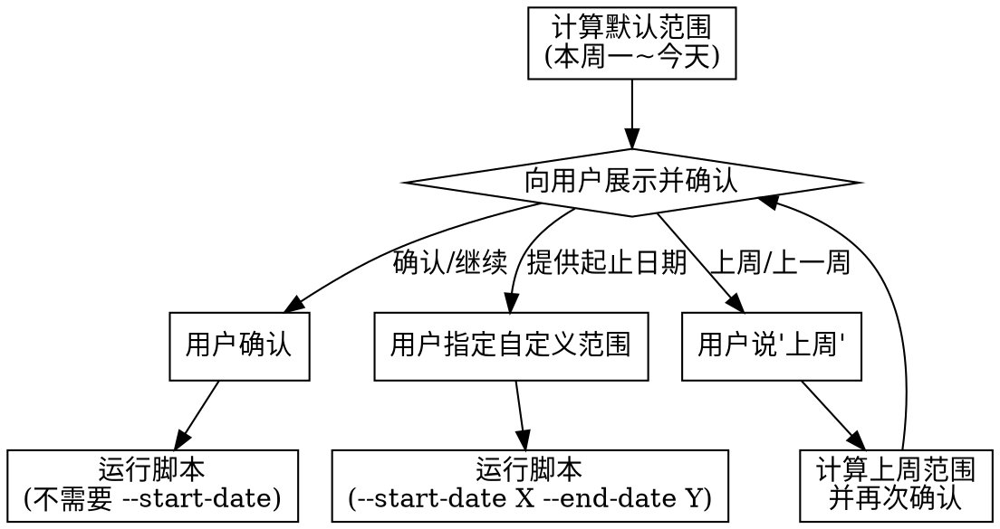

# DMS 非标询价周报生成器

## Overview

一键从 DMS 流程中心筛选已办询价流程，自动登录、提取项目详情和 BOM 清单、检查下单状态，生成格式化 Excel 汇总报告。使用 Playwright 自动化浏览器操作，支持多 Tab 并行提取和会话持久化。

## When to Use

当用户表达以下意图时触发（不需要用户明确说"使用周报skill"，直接认定）：

| 场景 | 用户可能说 |
|------|-----------|
| **定期周报** | "帮我做周报" / "这周询价汇总一下" / "做本周询价周报" |
| **临时查询** | "查一下上周的询价流程" / "看看最近有哪些询价" |
| **导出汇总** | "导出询价明细到Excel" / "把已办询价整理成表格" |
| **下单核查** | "检查哪些询价已下单了" / "哪些还没下单" |
| **批量获取** | "把最近两周的询价都提取出来" / "看看这个月的流程" |

## When NOT to Use

- ❌ **审批/驳回流程** — 本 skill 只读，不执行任何写入操作
- ❌ **创建新的询价流程** — 需要手动在 DMS 中填写
- ❌ **修改已有数据** — 不在本 skill 范围内
- ❌ **非 DMS 系统的数据提取** — 本 skill 仅针对 DMS 流程中心

## 使用流程

### 步骤 1：确认日期范围

计算默认范围（本周一到今天），然后向用户确认：

```python
from datetime import datetime, timedelta
today = datetime.now()
monday = today - timedelta(days=today.weekday())
# 默认: monday.strftime("%Y-%m-%d") ~ today.strftime("%Y-%m-%d")
```

使用 **AskUserQuestion** 工具向用户展示三个选项：

> .concept 以下日期仅为参考示例，实际执行时以 Python 实时计算为准（本周一 = `datetime.now() - timedelta(days=today.weekday())`）。

```
AskUserQuestion:
  question: "请选择周报的日期范围"
  header: "日期范围"
  options:
    - label: "本周（默认）"  →  description: "2026-06-01 ~ 2026-06-06（本周一到今天）"
    - label: "上周"          →  description: "2026-05-25 ~ 2026-05-31（上周一到上周日）"
    - label: "自定义"         →  description: "自行输入起止日期"
```

根据用户选择：
- **本周（默认）** → 不带 `--start-date` 运行脚本（使用脚本默认的本周逻辑）
- **上周** → 用 `--weeks 1` 运行脚本
- **自定义** → 让用户输入起止日期，用 `--start-date X --end-date Y` 运行脚本



### 步骤 2：运行脚本

本 skill 目录下的 `scripts/run_weekly_report.py` 执行实际工作：

```bash
SKILL_DIR="$(dirname "$(find ~/.claude/skills -name "run_weekly_report.py" 2>/dev/null | head -1)")"
SCRIPT="$SKILL_DIR/run_weekly_report.py"

# 用户确认默认范围
python "$SCRIPT" --output-dir "$PWD"

# 用户指定自定义范围
python "$SCRIPT" --output-dir "$PWD" --start-date "2026-05-01" --end-date "2026-05-31"

# 查上周（快捷方式）
python "$SCRIPT" --output-dir "$PWD" --weeks 1

# 无头模式（不显示浏览器）
python "$SCRIPT" --output-dir "$PWD" --headless
```

> **提示：** `--output-dir` 建议用 `"$PWD"` 输出到用户当前目录，方便查找。

### 步骤 3：呈现结果

脚本执行后会在终端打印摘要并生成 Excel，直接向用户报告：

```
✅ 周报生成完成！
📊 查询范围：2026-06-01 ~ 2026-06-06
📝 共 12 条询价记录
🟢 已下单 5 条 | 🔴 未下单 7 条
📎 Excel文件已保存到：D:\询价汇总.xlsx
```

## Quick Reference

### 参数速查

| 参数 | 说明 | 默认值 |
|------|------|--------|
| `--output-dir DIR` | 输出目录 | 当前工作目录 |
| `--headless` | 无头模式（不显示浏览器） | 显示浏览器 |
| `--weeks N` | 最近 N 周（0=本周, 1=上周） | 0 |
| `--start-date YYYY-MM-DD` | 自定义开始日期 | 本周一 |
| `--end-date YYYY-MM-DD` | 自定义结束日期 | 今天 |
| `--workers N` | 并行并发数 | 3 |
| `--verbose` | 详细日志输出 | 仅 info |

### 输出文件

- `{output_dir}/询价汇总.xlsx` — 蓝色表头、边框、自适应列宽
- `{output_dir}/询价汇总_v2.xlsx` — 文件名被占用时的备用

### Excel 列定义

| 列 | 说明 |
|----|------|
| 流程编号 | DMS 流程 ID |
| 项目名称 | 项目名称 |
| 代理商编号/名称 | 代理商信息 |
| 省公司 | 所属省份 |
| 业务员 | 负责销售 |
| 组件/逆变器/电池功率 | BOM 汇总 |
| 瓦单价/总价 | 价格 |
| 流程发起人提交审核时间 | 提交时间 |
| 备注 | BOM 特殊项 |
| 是否下单 | 是/否 |

## 前置依赖

```bash
pip install playwright openpyxl
playwright install chromium
```

首次使用需安装一次，之后无需重复。

## 登录配置

DMS 登录凭据通过环境变量读取，**不硬编码密码**。

**配置方式（二选一）：**

```bash
# 方式一：临时配置（仅当前会话有效）
export DMS_USER="your_email@trinapower.com"
export DMS_PASSWORD="your_password"

# 方式二：永久配置（推荐，添加到 ~/.bashrc）
echo 'export DMS_USER="your_email@trinapower.com"' >> ~/.bashrc
echo 'export DMS_PASSWORD="your_password"' >> ~/.bashrc
source ~/.bashrc
```

脚本自动按以下顺序检测凭据：
1. 当前进程环境变量
2. `~/.bashrc` → `~/.bash_profile` → `~/.profile`
3. PowerShell 用户环境变量

全部未找到时暂停执行，向用户说明如何配置。配置完成后让用户回复"已配置"，然后继续。

**登录持久化：** 使用 `launch_persistent_context` 保存登录状态到 `~/.dms_browser_data/`，首次登录后后续运行自动复用会话，无需重复登录。会话过期时自动重新登录。

## 安全约束

**本 skill 仅执行查询和数据提取操作，严格遵守以下规则：**

- **禁止：** 审批通过/驳回、提交表单、删除记录、修改数据、执行下单、发送邮件等任何写入/修改类操作
- **允许：** 登录、导航页面、筛选查询、读取页面内容
- 页面出现审批、提交、删除等按钮 → **一律忽略不点击**
- 意外跳转到审批/修改页面 → 立即返回，终端提示用户
- 所有浏览器操作仅限于读取页面内容，不做任何数据变更
- 使用 `ignore_https_errors=True` 仅用于内部 DMS 系统，不适用于生产环境

## 常见问题

### Q: 脚本报"未配置环境变量"但实际已配置

```
原因：当前 shell 未加载 profile 文件
解决：
  source ~/.bashrc    # Bash
  或重启终端后重试
  或用完整命令：bash -c 'source ~/.bashrc && python ...'
```

### Q: 提取到 0 条记录

```
可能原因：
  - 本周确实没有已办结的询价
  - 日期范围不对（用 --start-date 放大范围排查）
  - DMS 页面"已办流程"菜单选择器失效
```

### Q: DMS 页面结构变化导致选择器失效

```
现象：脚本能登录但提取不到数据
解决：需要更新 run_weekly_report.py 中的选择器常量
      主要关注：表格行选择器、表单字段选择器
      开启 --verbose 查看详细调试输出
```

### Q: Excel 文件保存失败

```
原因：目标文件被 Excel 或其他程序占用
解决：脚本自动使用 "询价汇总_v2.xlsx" 作为备用文件名
      关闭原文件后删除 .xlsx 再运行
```

### Q: 登录提示验证码

```
DMS 偶尔触发验证码验证，此时需要手动操作：
  1. 去掉 --headless 参数（显示浏览器）
  2. 在浏览器窗口中手动完成验证码
  3. 脚本会自动继续
```

## 脚本架构

核心模块：配置 → 登录 → 筛选 → 提取 → 下单检查 → Excel 生成 → 终端摘要

详细实现见 `scripts/run_weekly_report.py`。
